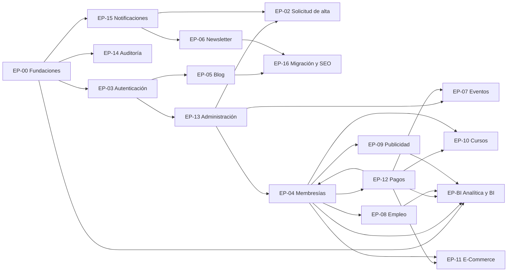

# NILOGISTIC — Fase 3: Backlog de producto priorizado

| Campo | Valor |
|---|---|
| Versión | **1.3** (Lote 2 de la Fase 4 aprobado con ajustes de Q-501 a Q-505) |
| Fecha | 05/10/2026 |
| Fase | 3 de 9 — Backlog de producto |
| Entrada | Fase 2 v1.4 (17 épicas, 145 RF, 40 RNF, 55 RN) |
| Estado | Aprobada. Fase 4 de R1 cerrada (Lotes 1 y 2 aprobados); Fase 5 en curso |

> **Nivel de detalle:** feature (FT-xxx). Cada feature se descompone en Historias de Usuario (HU-xxx) en la Fase 4. Los SP son estimaciones relativas gruesas y se **recalibran tras el Sprint 1**. Los IDs FT de la v0.1 se conservan sin cambios.

---

## 1. Estado y cambios respecto a v1.2

La v1.2 quedó aprobada y el **Lote 2 de la Fase 4 fue aprobado con ajustes**: R1 tiene HU completas. Esta v1.3 incorpora los ajustes de Q-501 a Q-505.

| # | Cambio | Efecto y consecuencia a vigilar |
|---|---|---|
| 1 | **Q-501:** mínimos de seguridad con un escenario cada uno, tope de 60 min del enlace de recuperación, 2FA indesactivable, duración absoluta de 12 h, reautenticación 2FA y aviso por correo, validados en la BLL | HU-062 sube de 5 a 8 SP y FT-099 de 8 a **11 SP** (+3). Estimación mía: la reautenticación 2FA, el aviso y los 9 escenarios nuevos no caben en 5 SP |
| 2 | **Fase 6:** HU-062 se separa en almacén de parámetros (S3) y pantalla (S7) | El almacén se necesita pronto porque lo leen login, bloqueo y sesiones (HU-014 a HU-018) |
| 3 | **Q-502:** registro único de suscriptor, evidencia de consentimiento, Newsletter distinta de los transaccionales, reconfirmación sin importación | HU-047, HU-053, HU-054 y HU-057; nueva RN-070 |
| 4 | **Q-503:** contacto con mensaje conservado, dos destinatarios (uno compartido), `Reply-To` y límite por correo destino | HU-043 y HU-063 |
| 5 | **Q-504:** retención de 24 meses con agregación mensual y rotulado "con consentimiento" | HU-070; nueva RN-071 |
| 6 | **Q-505:** RSS, comentarios y buscador global siguen en R4; FT-111 inventaría y redirige `/feed/` | FT-043 (RSS nuevo) se reevalúa con el consumo real (P-306) |

**Variación de volumen:** R1 pasa de 262 a **265 SP** (+3). El total del backlog es 673 SP (119 features).

---

## 2. Criterios de priorización

1. **MoSCoW** refinado en este backlog (prevalece sobre el preliminar de la Fase 2).
2. **Valor (1–5):** impacto en la misión, el ingreso y el riesgo operativo o legal.
3. **Esfuerzo (SP):** 2, 3, 5, 8 o 13. Los de 13 se dividen en la Fase 4.
4. **Índice V/E** = Valor ÷ SP × 10, usado dentro de un mismo release y MoSCoW.
5. **Las dependencias mandan** sobre el índice.

---

## 3. Estrategia de releases (aprobada, P-301)

| Release | Objetivo | Épicas | Valor al usuario |
|---|---|---|---|
| **R1** | Reemplazar WordPress y abrir el canal de captación | EP-00, 01, 02, 03 (base y 2FA), 05, 06, 07 (público), 13 (base), 14, 15, 16, BI (instrumentación) | Sitio nuevo con Blog, Eventos, Newsletter y solicitud de alta; Administración aprueba y crea cuentas |
| **R2** | Membresías y bolsa de talento | EP-04, 12, 08, 09, 07 (inscripción y pago), 03 (sub-usuarios), 13 (privacidad y contenido estático), BI (tablero) | Clientes con membresía publican vacantes y anuncios, postulan e inscriben a eventos; Administración ve el tablero |
| **R3** | Formación y comercio | EP-10, 11, descuentos, conciliación, BI (reportes y métricas de Empresa) | Cursos y tienda (libros, herramientas digitales, productos con retiro) |
| **R4** | Evolución | Los *Could* | Cupones, licencias, cohortes, destacados, alertas, panel de Gerente, BI externo |

**Puertas de calidad por release**

| Puerta | Criterio |
|---|---|
| G1 | Build y pruebas unitarias en verde en CI; cobertura BLL ≥ 70 % |
| G2 | Validación visual: responsive, WCAG 2.2 AA y Core Web Vitals en los flujos del release |
| G3 | Revisión de seguridad (OWASP Top 10, CSP, CSRF, rate limiting), prueba de permisos por rol y **2FA obligatorio verificado para Gerente y Administrador** |
| G4 | Auditoría verificada en todas las acciones de gestión del release |
| G5 | Respaldo y restauración probados; health checks activos |
| G6 | **Datos semilla reales validados por Jorge** antes del primer despliegue público (RN-056, D-019) |
| G7a | R1, **pre-corte**: rollback ensayado en Staging, redirecciones 301 cargadas y probadas, Search Console verificado, copia de los registros DNS y TTL reducido 48 horas antes |
| G7b | R1, **post-corte**: verificación de páginas públicas, redirecciones, sitemap, formularios y entrega de correo; sitemap enviado a Search Console; monitoreo de 72 horas sin necesidad de rollback |

---

## 4. Resumen cuantitativo

Total: **119 features**, **673 SP**.

| Release | Features | Must (SP) | Should (SP) | Could (SP) | Total SP |
|---|---|---|---|---|---|
| R1 | 46 | 265 | 0 | 0 | **265** |
| R2 | 40 | 159 | 47 | 0 | **206** |
| R3 | 18 | 84 | 41 | 0 | **125** |
| R4 | 15 | 0 | 0 | 77 | **77** |
| **Total** | 119 | 508 | 88 | 77 | **673** |

**Por épica**

| Épica | Features | SP | Releases |
|---|---|---|---|
| EP-00 Fundaciones técnicas (enablers) | 12 | 74 | R1 |
| EP-01 Sitio público | 8 | 34 | R1, R4 |
| EP-02 Solicitud de alta | 4 | 22 | R1, R2 |
| EP-03 Autenticación y cuenta | 7 | 43 | R1, R2 |
| EP-04 Membresías | 7 | 44 | R2, R3 |
| EP-05 Blog | 7 | 31 | R1, R2, R4 |
| EP-06 Newsletter | 5 | 32 | R1, R2 |
| EP-07 Eventos | 7 | 34 | R1, R2, R4 |
| EP-08 Bolsa de Empleo | 10 | 53 | R2, R4 |
| EP-09 Publicidad | 6 | 26 | R2, R3, R4 |
| EP-10 Cursos | 8 | 55 | R3, R4 |
| EP-11 E-Commerce | 8 | 63 | R3, R4 |
| EP-12 Pagos por transferencia | 8 | 42 | R2, R3 |
| EP-13 Administración | 6 | 37 | R1, R2 |
| EP-14 Auditoría | 2 | 7 | R1, R2 |
| EP-15 Notificaciones | 3 | 13 | R1, R4 |
| EP-16 Migración y SEO | 4 | 16 | R1 |
| EP-BI Analítica y BI | 7 | 47 | R1, R2, R3, R4 |

**Cobertura:** los 145 RF activos de la Fase 2 v1.2 están cubiertos por al menos un feature.

---

## 5. Planificación

### 5.1 Condiciones para iniciar el Sprint 0

Decisión D-038: arranque **no escalonado**. El Sprint 0 inicia el **lunes 09/11/2026**, tras aprobar las Fases 4 a 6. **Si la Fase 6 no está aprobada el 06/11, el Sprint 0 pasa al 16/11/2026.**

| Condición | Fecha meta | Estado | Responsable |
|---|---|---|---|
| Fase 4 aprobada **solo para R1** (Lotes 1 y 2) | 16/10/2026 | **Aprobada** (Lotes 1 y 2) | Jorge |
| Fase 5 aprobada: arquitectura y **modelo de datos de R1 a R3** | 30/10/2026 | En curso (borrador entregado) | Jorge |
| Fase 6 aprobada (plan de sprints) | 06/11/2026 | Pendiente | Jorge |
| Cuentas creadas: GitHub, Supabase, Render, Resend (tarea #3) | 06/11/2026 | Pendiente | Jorge |
| Acceso al panel DNS del dominio (tarea #2) | 06/11/2026 | Pendiente | Jorge |
| **Diseño visual** entregado (separado de la Fase 5; tarea #4) | **Antes del 20/11/2026** | Pendiente | Jorge |

**Reglas aprobadas (P-304):**

1. La Fase 4 que condiciona el Sprint 0 cubre solo R1; las HU de R2 y R3 se refinan durante los sprints de R1.
2. La Fase 5 cubre el modelo de datos y la arquitectura de **R1 a R3**.
3. Las HU de R2 se aprueban **con un sprint de anticipación**: cada HU de R2 debe estar aprobada antes del inicio del sprint previo al que la implementa. En el calendario base, el primer sprint de R2 es S12 (26/04/2027), por lo que el **Lote 3 (HU de R2) debe estar aprobado antes del 12/04/2027**.
4. La matriz de trazabilidad marca los RF de R2 y R3 como **pendientes de HU** hasta que se escriban.

### 5.2 Rangos de planificación (hasta recalibrar tras el Sprint 1)

La velocidad base es 26 SP por sprint, con un rango de 20 a 30. El R1 incluye 1 sprint final de estabilización sin features nuevas; en él se trabaja FT-113 (plan y ejecución del corte), actividad de salida del release. Las fechas parten del 09/11/2026 y **no descuentan feriados ni vacaciones**.

| Escenario | Velocidad | R1 (sprints) | Fin de R1 | R2 (sprints) | Fin de R2 | R3 (sprints) | Fin de R3 |
|---|---|---|---|---|---|---|---|
| Optimista | 30 SP | 10 | 26/03/2027 | 7 | 02/07/2027 | 5 | 10/09/2027 |
| **Base** | 26 SP | 12 | 23/04/2027 | 8 | 13/08/2027 | 5 | 22/10/2027 |
| Pesimista | 20 SP | 16 | 18/06/2027 | 11 | 19/11/2027 | 7 | 25/02/2028 |

Lectura: el fin de R1 queda entre el **26/03/2027** y el **18/06/2027**, con 23/04/2027 como caso base. Los rangos se estrechan tras el Sprint 1.

**Fallback: Sprint 0 el 16/11/2026** (si la Fase 6 no está aprobada el 06/11). Todas las fechas se desplazan una semana:

| Escenario | Fin de R1 (inicio 09/11) | Fin de R1 (inicio 16/11) |
|---|---|---|
| Optimista | 26/03/2027 | 02/04/2027 |
| **Base** | 23/04/2027 | 30/04/2027 |
| Pesimista | 18/06/2027 | 25/06/2027 |

**Aviso, escenario Optimista:** el sprint de estabilización (15/03/2027 – 26/03/2027) toca Semana Santa; semanas disponibles para el corte: semana del 15/03/2027.

### 5.3 Secuencia indicativa de R1 en el escenario base (a formalizar en la Fase 6)

Criterio: fundaciones técnicas y ruta crítica primero (Solución → Supabase/CI → base de dominio → auditoría → login → autorización → 2FA → usuarios y roles → solicitudes), luego *Must* por V/E, respetando dependencias. El layout base no entra antes del Sprint 1. **El 2FA (FT-029) se programa justo después de login y autorización.**

| Sprint | Fechas | Features | SP | Notas |
|---|---|---|---|---|
| S0 | 09/11/2026 – 20/11/2026 | FT-001 Solución N-Capas Nilogistic.* (8 proyectos),…; FT-004 Base de dominio: soft delete, repositorio gen…; FT-010 Plantilla de pruebas xUnit + Moq + FluentAsse…; FT-011 Datos semilla provisionales (roles, módulos,…; FT-110 Search Console y Analytics creados y verifica…; FT-111 Rastreo de URLs actuales (incluido /feed/) y… | 25 |  |
| S1 | 23/11/2026 – 04/12/2026 | FT-009 Layout base y sistema de diseño (diseño visua…; FT-002 Supabase: proyecto, migraciones con CLI, RLS…; FT-007 Procesos en segundo plano y tareas programada…; FT-119 Guardado automático de borradores en formular…; FT-013 Página Quiénes Somos | 26 |  |
| S2 | 07/12/2026 – 18/12/2026 | FT-003 CI/CD con GitHub Actions (build + tests) y de…; FT-005 Infraestructura de auditoría inmutable (inter…; FT-006 Servicio de notificaciones sobre Resend: subd…; FT-017 Páginas de error (403, 404, 500) | 26 | Incluye feriados: 8 de diciembre; capacidad probablemente menor |
| S3 | 21/12/2026 – 01/01/2027 | FT-107 Catálogo de notificaciones transaccionales (p…; FT-008 Seguridad transversal: HSTS/CSP, CSRF, rate l…; FT-016 Páginas legales con versionado mínimo (versió…; FT-014 Página Servicios / Membresías (comparativo in… | 24 | Incluye feriados: Navidad, Año Nuevo; capacidad probablemente menor |
| S4 | 04/01/2027 – 15/01/2027 | FT-020 Formulario público de solicitud (Profesional/…; FT-024 Login, logout, sesión y expiración por inacti…; FT-026 Bloqueo temporal por intentos fallidos; FT-025 Activación de cuenta y recuperación/cambio de… | 24 |  |
| S5 | 18/01/2027 – 29/01/2027 | FT-027 Autorización por rol, permiso READ/CREATE/UPD…; FT-029 2FA para Gerente y Administrador; FT-097 Gestión de usuarios, roles y permisos | 24 |  |
| S6 | 01/02/2027 – 12/02/2027 | FT-022 Bandeja de solicitudes: aprobar (crea cuenta…; FT-015 Contacto con formulario protegido y notificac…; FT-108 Webhooks de Resend (rebotes y quejas); FT-012 Página de Inicio; FT-028 Perfil propio; FT-039 Categorías y etiquetas | 25 |  |
| S7 | 15/02/2027 – 26/02/2027 | FT-112 SEO técnico: sitemap, robots, metadatos, Open…; FT-105 Consulta de auditoría con filtros y eventos d…; FT-038 Posts: editor enriquecido sanitizado, estados…; FT-040 Listado público con filtros, búsqueda y pagin… | 23 |  |
| S8 | 01/03/2027 – 12/03/2027 | FT-041 Detalle del post con SEO, Open Graph, compart…; FT-045 Suscripción pública con doble opt-in, baja en…; FT-046 Editor de newsletter con plantilla de marca,…; FT-098 Catálogos maestros (áreas logísticas, ubicaci… | 26 |  |
| S9 | 15/03/2027 – 26/03/2027 | FT-047 Envío segmentado vía Resend; FT-114 Instrumentación de eventos de negocio y de us… | 16 | Incluye feriados: Jueves Santo, Viernes Santo; capacidad probablemente menor |
| S10 | 29/03/2027 – 09/04/2027 | FT-099 Configuración general (remitentes, parámetros…; FT-050 Gestión de eventos (gratuito/de pago, tipo, p…; FT-051 Listado y detalle público de eventos con dato… | 21 |  |
| S11 | 12/04/2027 – 23/04/2027 | **Estabilización, sin features nuevas:** puertas G1 a G7a, correcciones, ensayo de rollback, corte de DNS (FT-113), puerta G7b y monitoreo | – | Ventana de corte (ver 5.4) |

Control de la regla del 2FA: FT-027 (autorización) en S5 y FT-029 (2FA) en S5.

### 5.4 Corte de DNS y Semana Santa 2027

Semana Santa 2027: del **21/03/2027** (Domingo de Ramos) al **28/03/2027** (Domingo de Resurrección). **No se realiza el corte de DNS en esa semana.** Práctica adicional: cortar de martes a jueves y no el día previo a un feriado.

Impacto de la fecha real de inicio del Sprint 0 (escenario base, sprint de estabilización de R1):

| Inicio del Sprint 0 | Sprint de estabilización | Semanas disponibles para el corte |
|---|---|---|
| 09/11/2026 | 12/04/2027 – 23/04/2027 | semana del 12/04/2027; semana del 19/04/2027 |
| 16/11/2026 | 19/04/2027 – 30/04/2027 | semana del 19/04/2027; semana del 26/04/2027 |
| 23/11/2026 | 26/04/2027 – 07/05/2027 | semana del 26/04/2027; semana del 03/05/2027 |
| 30/11/2026 | 03/05/2027 – 14/05/2027 | semana del 03/05/2027; semana del 10/05/2027 |
| 07/12/2026 | 10/05/2027 – 21/05/2027 | semana del 10/05/2027; semana del 17/05/2027 |

Si el corte cae fuera de las semanas disponibles, se mueve a la primera semana posterior a Semana Santa. Con inicio el 09/11/2026, Semana Santa cae en el sprint de features S9 (capacidad reducida por Jueves y Viernes Santo) y el sprint de estabilización queda después, sin conflicto. La Fase 6 fija la fecha definitiva.

### 5.5 Evaluación R1a/R1b

Sin cambios: **mantener R1 completo** y reabrir la decisión tras el Sprint 1 y la tarea #7 (P-303). Opción de referencia: R1a sin Newsletter (238 SP, 10 sprints de features) y R1b con Newsletter (27 SP).

---

## 6. Épica EP-BI — Analítica y BI

| Release | Entrega | Features |
|---|---|---|
| R1 | Instrumentación de eventos desde el primer día (los datos no se recuperan retroactivamente) | FT-114 |
| R2 | Capa de métricas y **tablero de Administración (Must)** | FT-115, FT-103 |
| R3 | Reportes con auditoría de exportación y métricas de Empresa (*Should*) | FT-104, FT-116 |
| R4 | Panel de Gerente y BI externo (*Could*) | FT-117, FT-118 |

**Decisiones de diseño que dejo para la Fase 5:** dónde se almacenan los eventos (tabla propia en PostgreSQL frente a depender solo de Analytics), política de retención, y herramienta de BI externo para R4 (por ejemplo Power BI, Looker Studio o Metabase). **Jorge entrega el diccionario de KPIs antes de refinar FT-103** (tarea #12). El núcleo de instrumentación vive en FT-114; el registro de cada evento se define dentro de las HU de cada módulo (campo *Analítica*).

---

## 7. Mapa de dependencias entre épicas

**Dependencia circular en R2:** Membresías necesita Pagos para comprar o renovar, y Pagos activa la membresía. Se rompe construyendo primero la capa de pagos y luego la compra; mientras tanto Administración asigna membresías manualmente.

**Ruta crítica R1:** Solución → Supabase/CI → base de dominio → auditoría → login → autorización → usuarios y roles → bandeja de solicitudes → corte de DNS.

**Ruta crítica R2:** planes → suscripción → registro y validación de pagos → compra de membresía → control de acceso → vacantes → moderación → postulación → gestión de postulantes → métricas → tablero.

---

## 8. Backlog por épica

Leyenda: **M**/**S**/**C** = Must/Should/Could · V = valor · SP = esfuerzo · V/E = índice · Dep. = features que lo habilitan.

### EP-00 — Fundaciones técnicas (enablers)

| ID | Feature | Requerimientos | MoSCoW | V | SP | V/E | Dep. | Rel. | Cambio vs v1.2 |
|---|---|---|---|---|---|---|---|---|---|
| FT-004 | Base de dominio: soft delete, repositorio genérico, UTC y convenciones de entidad | RN-001, RN-002, RNF-MAN-06, MAN-07 | M | 5 | 5 | 10.0 | FT-001 | R1 |  |
| FT-010 | Plantilla de pruebas xUnit + Moq + FluentAssertions y umbral de cobertura | RNF-MAN-02 | M | 3 | 3 | 10.0 | FT-001 | R1 |  |
| FT-011 | Datos semilla provisionales (roles, módulos, catálogos, planes) con marca de provisional | RN-056, D-019 | M | 3 | 3 | 10.0 | FT-004 | R1 |  |
| FT-007 | Procesos en segundo plano y tareas programadas (gracia, cierres automáticos, envíos programados) | RN-015, RN-045, RN-051 | M | 4 | 5 | 8.0 | FT-001, FT-002 | R1 |  |
| FT-009 | Layout base y sistema de diseño (diseño visual de Jorge), accesibilidad base | RNF-USA-01, USA-02 | M | 4 | 5 | 8.0 | FT-001 | R1 |  |
| FT-119 | Guardado automático de borradores en formularios de gestión (servidor, respaldo local y recuperación tras reautenticación) | RNF-USA-05 | M | 4 | 5 | 8.0 | FT-009, FT-002 | R1 |  |
| FT-001 | Solución N-Capas Nilogistic.* (8 proyectos), convenciones, Swagger/OpenAPI y health checks | RNF-MAN-01, MAN-05, DIS-03 | M | 5 | 8 | 6.2 | – | R1 |  |
| FT-002 | Supabase: proyecto, migraciones con CLI, RLS base y buckets privados | RNF-DIS-05, SEG-06, SEG-07 | M | 5 | 8 | 6.2 | FT-001 | R1 |  |
| FT-003 | CI/CD con GitHub Actions (build + tests) y despliegue en Render (staging y producción), secretos y migraciones desde CI | RNF-MAN-03, SEG-05, DIS-05 | M | 5 | 8 | 6.2 | FT-001 | R1 |  |
| FT-005 | Infraestructura de auditoría inmutable (interceptor EF y/o triggers, según decisión técnica #5) | RF-AUD-01, RF-AUD-04; RN-005, RN-060 | M | 5 | 8 | 6.2 | FT-004, FT-002 | R1 |  |
| FT-006 | Servicio de notificaciones sobre Resend: subdominio de envío, SPF/DKIM/DMARC, plantillas base y cola con reintentos | RF-NOT-01, RF-NOT-02, RF-NOT-04; D-005 | M | 5 | 8 | 6.2 | FT-001 | R1 |  |
| FT-008 | Seguridad transversal: HSTS/CSP, CSRF, rate limiting, anti-bot y logging estructurado | RNF-SEG-02..04, OBS-01 | M | 5 | 8 | 6.2 | FT-001 | R1 |  |

### EP-01 — Sitio público

| ID | Feature | Requerimientos | MoSCoW | V | SP | V/E | Dep. | Rel. | Cambio vs v1.2 |
|---|---|---|---|---|---|---|---|---|---|
| FT-013 | Página Quiénes Somos | RF-PUB-02 | M | 4 | 3 | 13.3 | FT-009 | R1 |  |
| FT-014 | Página Servicios / Membresías (comparativo informativo; se vuelve dinámica en R2) | RF-PUB-03 | M | 4 | 3 | 13.3 | FT-009 | R1 |  |
| FT-015 | Contacto con formulario protegido y notificación | RF-PUB-04 | M | 4 | 3 | 13.3 | FT-009, FT-008, FT-006 | R1 |  |
| FT-012 | Página de Inicio | RF-PUB-01 | M | 5 | 5 | 10.0 | FT-009 | R1 |  |
| FT-017 | Páginas de error (403, 404, 500) | RF-PUB-07 | M | 2 | 2 | 10.0 | FT-009 | R1 |  |
| FT-016 | Páginas legales con **versionado mínimo** (versión y fecha de vigencia, registro de la versión aceptada) y banner de consentimiento de cookies | RF-PUB-05, RF-PUB-06; RNF-PRI-02; RF-ADM-04 (parcial) | M | 5 | 8 | 6.2 | FT-009 | R1 |  |
| FT-018 | Directorio público de empresas miembro | RF-PUB-08 | C | 2 | 5 | 4.0 | FT-032 | R4 |  |
| FT-019 | Buscador global del contenido público | RF-PUB-09 | C | 2 | 5 | 4.0 | FT-040, FT-051 | R4 |  |

### EP-02 — Solicitud de alta

| ID | Feature | Requerimientos | MoSCoW | V | SP | V/E | Dep. | Rel. | Cambio vs v1.2 |
|---|---|---|---|---|---|---|---|---|---|
| FT-020 | Formulario público de solicitud (Profesional/Empresa) con consentimiento y anti-bot | RF-REG-01, RF-REG-02, RF-REG-03 | M | 5 | 8 | 6.2 | FT-009, FT-008, FT-016 | R1 |  |
| FT-022 | Bandeja de solicitudes: aprobar (crea cuenta y envía acceso) o rechazar con motivo | RF-REG-05, RF-REG-06, RF-REG-07; RN-010 | M | 5 | 8 | 6.2 | FT-020, FT-097, FT-025, FT-107 | R1 |  |
| FT-021 | Verificación de correo del solicitante | RF-REG-04 | S | 3 | 3 | 10.0 | FT-020, FT-006 | R2 |  |
| FT-023 | Detección de solicitudes duplicadas | RF-REG-08; RN-011 | S | 3 | 3 | 10.0 | FT-020 | R2 |  |

### EP-03 — Autenticación y cuenta

| ID | Feature | Requerimientos | MoSCoW | V | SP | V/E | Dep. | Rel. | Cambio vs v1.2 |
|---|---|---|---|---|---|---|---|---|---|
| FT-026 | Bloqueo temporal por intentos fallidos | RF-AUT-05 | M | 4 | 3 | 13.3 | FT-024 | R1 |  |
| FT-025 | Activación de cuenta y recuperación/cambio de contraseña | RF-AUT-02, RF-AUT-03 | M | 5 | 5 | 10.0 | FT-024, FT-006 | R1 |  |
| FT-028 | Perfil propio | RF-AUT-08 | M | 3 | 3 | 10.0 | FT-024 | R1 |  |
| FT-024 | Login, logout, sesión y expiración por inactividad | RF-AUT-01, RF-AUT-04 | M | 5 | 8 | 6.2 | FT-002, FT-008 | R1 |  |
| FT-027 | Autorización por rol, permiso READ/CREATE/UPDATE por módulo y membresía | RF-AUT-07; RN-062 | M | 5 | 8 | 6.2 | FT-024 | R1 |  |
| FT-029 | 2FA para Gerente y Administrador | RF-AUT-06, RF-AUT-11; RN-061, RN-067 | M | 5 | 8 | 6.2 | FT-024, FT-027 | R1 |  |
| FT-030 | Sub-usuarios de empresa: invitación 72 h, límite por plan, desactivación y transferencia de rol principal | RF-AUT-09, RF-AUT-10; RN-010, RN-027 | M | 4 | 8 | 5.0 | FT-032, FT-027, FT-006 | R2 |  |

### EP-04 — Membresías

| ID | Feature | Requerimientos | MoSCoW | V | SP | V/E | Dep. | Rel. | Cambio vs v1.2 |
|---|---|---|---|---|---|---|---|---|---|
| FT-033 | Compra y renovación de membresía por transferencia | RF-MEM-03; RN-041 | M | 5 | 5 | 10.0 | FT-032, FT-090, FT-091 | R2 |  |
| FT-035 | Período de gracia, alertas de vencimiento y paso automático de estado | RF-MEM-06, RF-MEM-09; RN-015 | M | 4 | 5 | 8.0 | FT-032, FT-007, FT-107 | R2 |  |
| FT-031 | Planes, precios por periodicidad y beneficios parametrizables (Plan, PlanPrecio, PlanBeneficio) | RF-MEM-01, RF-MEM-10, RF-MEM-11; RN-017, RN-018, RN-019 | M | 5 | 8 | 6.2 | FT-004, FT-011, FT-005 | R2 |  |
| FT-032 | Suscripción: asignación por Administración, estados (Activa, EnGracia, Vencida, Reactivada) e historial | RF-MEM-02, RF-MEM-04, RF-MEM-08; RN-012 | M | 5 | 8 | 6.2 | FT-031, FT-097 | R2 |  |
| FT-034 | Control de acceso por membresía y modo solo lectura organizacional | RF-MEM-05; RN-013, RN-015 | M | 5 | 8 | 6.2 | FT-032, FT-027 | R2 |  |
| FT-036 | Reactivación automática de vacantes y anuncios si se renueva en ≤ 30 días | RF-MEM-12; RN-015 | M | 3 | 5 | 6.0 | FT-035, FT-058, FT-067 | R2 |  |
| FT-037 | Descuentos automáticos de membresía en Cursos y E-Commerce | RF-MEM-07, RF-ECO-05; RN-046 | M | 4 | 5 | 8.0 | FT-032, FT-073, FT-081 | R3 |  |

### EP-05 — Blog

| ID | Feature | Requerimientos | MoSCoW | V | SP | V/E | Dep. | Rel. | Cambio vs v1.2 |
|---|---|---|---|---|---|---|---|---|---|
| FT-039 | Categorías y etiquetas | RF-BLG-05 | M | 3 | 3 | 10.0 | FT-004 | R1 |  |
| FT-040 | Listado público con filtros, búsqueda y paginación | RF-BLG-03 | M | 5 | 5 | 10.0 | FT-038, FT-009 | R1 |  |
| FT-041 | Detalle del post con SEO, Open Graph, compartir y relacionados | RF-BLG-04 | M | 5 | 5 | 10.0 | FT-040, FT-112 | R1 |  |
| FT-038 | Posts: editor enriquecido sanitizado, estados, programación y portada | RF-BLG-01, RF-BLG-02; RN-020 | M | 5 | 8 | 6.2 | FT-027, FT-005, FT-007, FT-002, FT-119 | R1 |  |
| FT-042 | Autores/expertos colaboradores (ficha pública) | RF-BLG-06 | S | 3 | 3 | 10.0 | FT-038 | R2 |  |
| FT-043 | Feed RSS | RF-BLG-07 | C | 2 | 2 | 10.0 | FT-040 | R4 |  |
| FT-044 | Comentarios moderados | RF-BLG-08 | C | 2 | 5 | 4.0 | FT-041, FT-027 | R4 |  |

### EP-06 — Newsletter

| ID | Feature | Requerimientos | MoSCoW | V | SP | V/E | Dep. | Rel. | Cambio vs v1.2 |
|---|---|---|---|---|---|---|---|---|---|
| FT-045 | Suscripción pública con doble opt-in, baja en un clic y preferencias | RF-NWS-01, RF-NWS-02; RN-030, RN-031 | M | 5 | 8 | 6.2 | FT-008, FT-006, FT-009 | R1 |  |
| FT-046 | Editor de newsletter con plantilla de marca, vista previa y envío de prueba | RF-NWS-03, RF-NWS-04 | M | 5 | 8 | 6.2 | FT-027, FT-006, FT-005, FT-119 | R1 |  |
| FT-047 | Envío segmentado vía Resend | RF-NWS-05; RN-032 | M | 5 | 8 | 6.2 | FT-046, FT-045, FT-108 | R1 |  |
| FT-048 | Programación de envío | RF-NWS-06 | S | 3 | 3 | 10.0 | FT-047, FT-007 | R2 |  |
| FT-049 | Métricas de envío y supresión automática de rebotes y quejas | RF-NWS-07, RF-NWS-08 | S | 3 | 5 | 6.0 | FT-047, FT-108 | R2 |  |

### EP-07 — Eventos

| ID | Feature | Requerimientos | MoSCoW | V | SP | V/E | Dep. | Rel. | Cambio vs v1.2 |
|---|---|---|---|---|---|---|---|---|---|
| FT-051 | Listado y detalle público de eventos con datos estructurados | RF-EVT-02, RF-EVT-03 | M | 5 | 5 | 10.0 | FT-050, FT-112 | R1 |  |
| FT-050 | Gestión de eventos (gratuito/de pago, tipo, precio, cupo, lista de espera) | RF-EVT-01; RN-021 | M | 4 | 5 | 8.0 | FT-027, FT-005, FT-002, FT-099, FT-119 | R1 |  |
| FT-052 | Inscripción a eventos con control de cupo (gratuitos) | RF-EVT-04; RN-051, RN-052; D-020: sin exigir membresía | M | 4 | 5 | 8.0 | FT-051, FT-027 | R2 |  |
| FT-053 | Eventos de pago: cupo reservado y confirmación con pago validado | RF-EVT-06; RN-052 | M | 4 | 5 | 8.0 | FT-052, FT-091 | R2 |  |
| FT-055 | Confirmación y recordatorios por Resend | RF-EVT-05 | S | 3 | 3 | 10.0 | FT-052, FT-107, FT-007 | R2 |  |
| FT-054 | Lista de espera con oferta de cupo y ventana de confirmación | RF-EVT-08; RN-051 | S | 3 | 8 | 3.8 | FT-052, FT-007, FT-107 | R2 |  |
| FT-056 | Galería y material posterior al evento | RF-EVT-07 | C | 2 | 3 | 6.7 | FT-051, FT-002 | R4 |  |

### EP-08 — Bolsa de Empleo

| ID | Feature | Requerimientos | MoSCoW | V | SP | V/E | Dep. | Rel. | Cambio vs v1.2 |
|---|---|---|---|---|---|---|---|---|---|
| FT-059 | Moderación de vacantes por Administración | RF-EMP-02; RN-022, RN-023 | M | 5 | 5 | 10.0 | FT-058, FT-107 | R2 |  |
| FT-060 | Listado, búsqueda y filtros de vacantes | RF-EMP-03 | M | 5 | 5 | 10.0 | FT-059 | R2 |  |
| FT-061 | Postulación con control de duplicados | RF-EMP-05; RN-024 | M | 5 | 5 | 10.0 | FT-057, FT-060 | R2 |  |
| FT-057 | Perfil profesional y carga de CV (PDF) | RF-EMP-04; RN-026 | M | 5 | 8 | 6.2 | FT-034, FT-002 | R2 |  |
| FT-058 | Vacantes: alta y edición por la empresa con límites del plan | RF-EMP-01; RN-014 | M | 5 | 8 | 6.2 | FT-034, FT-027 | R2 |  |
| FT-062 | Gestión de postulantes por la empresa (estados) | RF-EMP-06; RN-025 | M | 5 | 8 | 6.2 | FT-061 | R2 |  |
| FT-063 | Notificaciones de empleo | RF-EMP-07 | S | 3 | 3 | 10.0 | FT-061, FT-107 | R2 |  |
| FT-064 | Vigencia y cierre automático de vacantes | RF-EMP-08 | S | 3 | 3 | 10.0 | FT-058, FT-007 | R2 |  |
| FT-066 | Vista pública parcial de vacantes | RF-EMP-10 | C | 3 | 3 | 10.0 | FT-060, FT-112 | R4 |  |
| FT-065 | Alertas de nuevas vacantes para Profesionales | RF-EMP-09 | C | 2 | 5 | 4.0 | FT-060, FT-007 | R4 |  |

### EP-09 — Publicidad

| ID | Feature | Requerimientos | MoSCoW | V | SP | V/E | Dep. | Rel. | Cambio vs v1.2 |
|---|---|---|---|---|---|---|---|---|---|
| FT-068 | Moderación de anuncios | RF-ADS-02; RN-022 | M | 4 | 3 | 13.3 | FT-067, FT-107 | R2 |  |
| FT-070 | Vigencia del anuncio y regla de visibilidad | RF-ADS-04; RN-055 | M | 4 | 3 | 13.3 | FT-067, FT-007 | R2 |  |
| FT-067 | Anuncios: alta y edición por la empresa con límite de piezas del plan | RF-ADS-01, RF-ADS-07; RN-055 | M | 4 | 5 | 8.0 | FT-034 | R2 |  |
| FT-069 | Sección pública de Publicidad con filtros | RF-ADS-03 | M | 4 | 5 | 8.0 | FT-068, FT-009 | R2 |  |
| FT-071 | Métricas por anuncio (vistas y clics) | RF-ADS-05 | S | 3 | 5 | 6.0 | FT-069 | R3 |  |
| FT-072 | Posiciones destacadas y piezas adicionales como servicio | RF-ADS-06 | C | 2 | 5 | 4.0 | FT-069 | R4 |  |

### EP-10 — Cursos

| ID | Feature | Requerimientos | MoSCoW | V | SP | V/E | Dep. | Rel. | Cambio vs v1.2 |
|---|---|---|---|---|---|---|---|---|---|
| FT-073 | Gestión de cursos por Administración | RF-CUR-01; RN-021 | M | 4 | 5 | 8.0 | FT-027, FT-005, FT-002 | R3 |  |
| FT-074 | Catálogo y detalle de cursos | RF-CUR-02 | M | 4 | 5 | 8.0 | FT-073, FT-112 | R3 |  |
| FT-075 | Inscripción con descuento y pago por transferencia | RF-CUR-03, RF-CUR-04; RN-041 | M | 5 | 8 | 6.2 | FT-074, FT-034, FT-091, FT-037 | R3 |  |
| FT-076 | Material del curso con URLs firmadas | RF-CUR-05; RN-016 | M | 5 | 8 | 6.2 | FT-075, FT-002 | R3 |  |
| FT-077 | Seguimiento de avance del alumno | RF-CUR-06 | S | 3 | 5 | 6.0 | FT-076 | R3 |  |
| FT-078 | Certificado PDF con código de verificación | RF-CUR-07 | S | 3 | 8 | 3.8 | FT-077 | R3 |  |
| FT-079 | Sesiones en vivo o cohortes con calendario | RF-CUR-08 | C | 2 | 8 | 2.5 | FT-075 | R4 |  |
| FT-080 | Evaluaciones | RF-CUR-09 | C | 2 | 8 | 2.5 | FT-077 | R4 |  |

### EP-11 — E-Commerce

| ID | Feature | Requerimientos | MoSCoW | V | SP | V/E | Dep. | Rel. | Cambio vs v1.2 |
|---|---|---|---|---|---|---|---|---|---|
| FT-086 | Cancelación automática por plazo y liberación de stock | RN-045 | M | 3 | 3 | 10.0 | FT-083, FT-007 | R3 |  |
| FT-083 | Pedidos, estados e historial del cliente | RF-ECO-06, RF-ECO-09; RN-043 | M | 5 | 8 | 6.2 | FT-082, FT-091 | R3 |  |
| FT-084 | Entrega segura de bienes digitales (URL firmada y límite de descargas) | RF-ECO-07; RN-047 | M | 5 | 8 | 6.2 | FT-083, FT-002 | R3 |  |
| FT-085 | Productos físicos: retiro, stock y reserva | RF-ECO-08; RN-048, RN-053 | M | 4 | 8 | 5.0 | FT-083 | R3 |  |
| FT-081 | Catálogo y gestión de productos (Libro, Herramienta digital, Producto) con precios NIO/USD | RF-ECO-01, RF-ECO-02; RN-042 | M | 5 | 13 | 3.8 | FT-027, FT-005, FT-002, FT-099 | R3 |  |
| FT-082 | Carrito y checkout con selección de moneda | RF-ECO-03, RF-ECO-04; RN-042, RN-043 | M | 5 | 13 | 3.8 | FT-081, FT-034, FT-089 | R3 |  |
| FT-087 | Cupones y promociones | RF-ECO-11; RN-046 | C | 2 | 5 | 4.0 | FT-082 | R4 |  |
| FT-088 | Licencias o claves para herramientas digitales | RF-ECO-12 | C | 2 | 5 | 4.0 | FT-084 | R4 |  |

### EP-12 — Pagos por transferencia

| ID | Feature | Requerimientos | MoSCoW | V | SP | V/E | Dep. | Rel. | Cambio vs v1.2 |
|---|---|---|---|---|---|---|---|---|---|
| FT-089 | Datos bancarios e instrucciones de transferencia por moneda (NIO/USD) | RF-PAG-01 | M | 4 | 3 | 13.3 | FT-099 | R2 |  |
| FT-092 | Capa de pagos extensible (IProveedorPago) y pago polimórfico | RF-PAG-07 | M | 4 | 5 | 8.0 | FT-004 | R2 |  |
| FT-094 | Registro manual de N.º de factura y adjunto del PDF | RF-ECO-10; RN-050, RN-054 | M | 4 | 5 | 8.0 | FT-091 | R2 |  |
| FT-090 | Registro de pago con comprobante en almacenamiento privado | RF-PAG-02; RN-040 | M | 5 | 8 | 6.2 | FT-002, FT-027, FT-089 | R2 |  |
| FT-091 | Bandeja de validación manual y activación del objeto pagado | RF-PAG-03, RF-PAG-04; RN-041, RN-044 | M | 5 | 8 | 6.2 | FT-090, FT-005, FT-107 | R2 |  |
| FT-093 | Detección de comprobantes y referencias duplicadas | RF-PAG-05 | S | 3 | 3 | 10.0 | FT-090 | R2 |  |
| FT-095 | Conciliación y reporte de pagos por periodo y moneda | RF-PAG-06 | S | 3 | 5 | 6.0 | FT-091 | R3 |  |
| FT-096 | Reembolsos y ajustes como transacciones nuevas | RF-PAG-08; RN-049 | S | 3 | 5 | 6.0 | FT-091 | R3 |  |

### EP-13 — Administración

| ID | Feature | Requerimientos | MoSCoW | V | SP | V/E | Dep. | Rel. | Cambio vs v1.2 |
|---|---|---|---|---|---|---|---|---|---|
| FT-097 | Gestión de usuarios, roles y permisos | RF-ADM-01, RF-ADM-02; RN-063 | M | 5 | 8 | 6.2 | FT-027, FT-005 | R1 |  |
| FT-098 | Catálogos maestros (áreas logísticas, ubicaciones, tipos de contrato, categorías) | RF-ADM-03 | M | 3 | 5 | 6.0 | FT-004 | R1 |  |
| FT-099 | Configuración general (remitentes, parámetros de seguridad configurables; tipo de cambio y datos bancarios se amplían en R2) | RF-ADM-07; Q-401 | M | 4 | 11 | 3.6 | FT-004, FT-005 | R1 | SP 8→11 |
| FT-101 | Anonimización de usuario por solicitud de privacidad | RF-ADM-08; RN-004 | M | 4 | 5 | 8.0 | FT-097, FT-005 | R2 |  |
| FT-102 | Exportación de datos personales de un usuario | RF-ADM-09 | S | 3 | 3 | 10.0 | FT-097 | R2 |  |
| FT-100 | Contenido estático con versionado (Inicio, Quiénes Somos, textos legales) | RF-ADM-04 | S | 3 | 5 | 6.0 | FT-004, FT-005 | R2 |  |

### EP-14 — Auditoría

| ID | Feature | Requerimientos | MoSCoW | V | SP | V/E | Dep. | Rel. | Cambio vs v1.2 |
|---|---|---|---|---|---|---|---|---|---|
| FT-105 | Consulta de auditoría con filtros y eventos de seguridad | RF-AUD-02, RF-AUD-03 | M | 4 | 5 | 8.0 | FT-005 | R1 |  |
| FT-106 | Exportación de la bitácora | RF-AUD-05 | S | 2 | 2 | 10.0 | FT-105 | R2 |  |

### EP-15 — Notificaciones

| ID | Feature | Requerimientos | MoSCoW | V | SP | V/E | Dep. | Rel. | Cambio vs v1.2 |
|---|---|---|---|---|---|---|---|---|---|
| FT-108 | Webhooks de Resend (rebotes y quejas) | RF-NOT-05; RN-032 | M | 4 | 3 | 13.3 | FT-006 | R1 |  |
| FT-107 | Catálogo de notificaciones transaccionales (plantillas por evento de negocio; cada módulo suma las suyas) | RF-NOT-03; RN-033 | M | 4 | 5 | 8.0 | FT-006 | R1 |  |
| FT-109 | Notificaciones dentro del sitio | RF-NOT-06 | C | 2 | 5 | 4.0 | FT-027 | R4 |  |

### EP-16 — Migración y SEO

| ID | Feature | Requerimientos | MoSCoW | V | SP | V/E | Dep. | Rel. | Cambio vs v1.2 |
|---|---|---|---|---|---|---|---|---|---|
| FT-110 | Search Console y Analytics creados y verificados (con consentimiento de cookies) — acción inmediata | RF-MIG-05, RF-MIG-07; D-015 | M | 4 | 3 | 13.3 | – | R1 |  |
| FT-111 | Rastreo de URLs actuales (incluido /feed/) y mapa de redirecciones 301 | RF-MIG-01, RF-MIG-03 | M | 4 | 3 | 13.3 | – | R1 | + /feed/ |
| FT-112 | SEO técnico: sitemap, robots, metadatos, Open Graph y datos estructurados | RF-MIG-04; RNF-SEO-01, SEO-02 | M | 5 | 5 | 10.0 | FT-009 | R1 |  |
| FT-113 | Plan de corte de DNS, rollback y convivencia con el sitio actual | RF-MIG-06 | M | 5 | 5 | 10.0 | FT-111, FT-112, FT-016, FT-006 | R1 |  |

### EP-BI — Analítica y BI

| ID | Feature | Requerimientos | MoSCoW | V | SP | V/E | Dep. | Rel. | Cambio vs v1.2 |
|---|---|---|---|---|---|---|---|---|---|
| FT-114 | Instrumentación de eventos de negocio y de uso (catálogo de eventos, captura asíncrona, consentimiento y seudonimización) | RF-BI-01; RN-057, RNF-REN-05 | M | 4 | 8 | 5.0 | FT-002, FT-004, FT-016, FT-007 | R1 |  |
| FT-115 | Capa de métricas: diccionario de KPIs y agregados (vistas SQL o materializadas) | RF-BI-02, RF-BI-08, RF-BI-09; RN-064, RN-065, RN-066 | M | 4 | 5 | 8.0 | FT-114 | R2 |  |
| FT-103 | Tablero de Administración (solicitudes, membresías, pagos por validar, moderaciones, eventos y cupos, ingresos por moneda) | RF-ADM-05, RF-BI-03, RF-BI-09; RN-065 | M | 5 | 8 | 6.2 | FT-114, FT-115, FT-097, FT-032 | R2 |  |
| FT-116 | Métricas para Empresa: vistas y clics de anuncios, vistas de vacantes, postulaciones y embudo | RF-BI-05, RF-BI-08; RN-064 | S | 3 | 5 | 6.0 | FT-115, FT-071, FT-062 | R3 |  |
| FT-104 | Reportes exportables con auditoría de cada exportación | RF-ADM-06, RF-BI-04, RF-BI-09; RN-058, RN-065 | S | 3 | 8 | 3.8 | FT-103, FT-005 | R3 |  |
| FT-117 | Panel de Gerente: lecturas del Blog, suscriptores, aperturas y clics de la Newsletter | RF-BI-06 | C | 2 | 5 | 4.0 | FT-115, FT-049, FT-041 | R4 |  |
| FT-118 | Integración con BI externo: vistas de solo lectura y credenciales dedicadas, sin datos personales | RF-BI-07; RN-057, RN-058, RN-066 | C | 2 | 8 | 2.5 | FT-115 | R4 |  |

---

## 9. Decisiones técnicas pendientes y qué feature bloquean

Se resuelven en la **Fase 5 (Diseño)**, antes de implementar.

| # | Decisión | Bloquea | Nota para la Fase 5 |
|---|---|---|---|
| 1 | Doble salto MVC→API vs. MVC→BLL en páginas de marketing | FT-001, todos los controladores | Afecta la estructura de cada módulo y el costo por feature |
| 2 | Realtime (Supabase vs. SignalR) | – | Fuera del alcance inicial (D-008) |
| 3 | EF Core directo vs. RLS; uso de service role | FT-002, FT-027 | Define dónde vive la autorización |
| 4 | Supabase Auth (JWT) vs. cookie de sesión en MVC; alta por administración | FT-024, FT-025, FT-030, FT-029 | Condiciona invitaciones de 72 h y 2FA |
| 5 | Auditoría: interceptor EF y/o triggers | FT-005 | Debe ser atómica con la operación (RN-060) |
| 6 | Políticas de buckets (comprobantes, CVs, material) | FT-002, FT-090, FT-057, FT-076 | Buckets privados con URLs firmadas |
| 7 | Versión de PostgreSQL en Supabase | FT-002 | Verificar la versión disponible al crear el proyecto |
| 8 | Render: plan, cold starts, health checks, migraciones desde CI | FT-003 | RNF-DIS-02 exige evitar cold starts en producción |
| 9 | Multi-tenant | – | Resuelta: no aplica (D-007) |
| 10 | Administrador y soft delete | FT-004 | Resuelta: soft delete también para el Administrador (RN-001) |
| 11 | Mecanismo de tareas programadas y cola de correo en Render | FT-007 | Necesario para gracia, cierres automáticos y envíos programados |
| 12 | Editor de contenido enriquecido y sanitización de HTML | FT-038, FT-046 | Riesgo XSS (OWASP) en Blog y Newsletter |
| 13 (nueva) | Almacenamiento de eventos de analítica, retención y relación con Analytics | FT-114, FT-115 | Debe cumplir RN-057 y RNF-REN-05; impacta volumen en Supabase |
| 14 (nueva) | Lectura de la IP real detrás del proxy de Render e IPv6 agrupada por /64 | FT-008, FT-024 | Base de HU-013 y HU-018 (S-406): proxies de confianza y cabeceras permitidas |

---

## 10. Prerrequisitos y tareas de negocio (no son desarrollo)

| # | Tarea | Responsable | Cuándo | Bloquea |
|---|---|---|---|---|
| 1 | Crear y verificar Search Console y Analytics en el sitio actual | Jorge | **Ahora** | FT-110 |
| 2 | Acceso al panel DNS y registro de los registros actuales (MX, SPF, otros) | Jorge | Antes de Sprint 0 | FT-006, FT-113 |
| 3 | Cuentas de GitHub, Supabase, Render y Resend (planes definidos) | Jorge | Antes de Sprint 0 | FT-003, FT-002 |
| 4 | Entregar el diseño visual (separado de la Fase 5) | Jorge | **Antes del 20/11/2026** | FT-009 |
| 5 | Redactar contenido nuevo: Inicio, Quiénes Somos, Servicios, Contacto | Jorge / negocio | Antes de cargar R1 | FT-012, FT-013 |
| 6 | Textos legales (privacidad, términos, cookies) con asesoría legal; validar Ley 787 | Jorge / asesor legal | Antes de R1 | FT-016, FT-020 |
| 7 | Verificar si existe lista de suscriptores y evidencia de consentimiento para importarla | Jorge | Antes de cerrar el plan de R1 (idealmente tras el Sprint 1) | FT-045; decisión R1a/R1b |
| 8 | Definir áreas logísticas, ubicaciones y tipos de contrato (catálogos) y la regla laxa de validación del RUC. **Respaldo si se retrasa:** catálogo provisional (HU-039) y RUC laxo (HU-026) | Jorge / negocio | **Antes del 21/12/2026** | FT-020, FT-098 |
| 9 | Datos bancarios por moneda y fuente del tipo de cambio | Jorge / finanzas | Antes de R2 | FT-089, FT-099 |
| 10 | **Valores reales de planes** (precios, descuentos, límites) | Jorge / negocio | Antes del primer despliegue público (RN-056) | FT-031, FT-011 |
| 11 | Lugar y horario de retiro de productos físicos | Jorge / operaciones | Antes de R3 | FT-085 |
| 12 (nueva) | Diccionario de KPIs del tablero de Administración | Jorge / negocio | Antes de R2 | FT-115, FT-103 |
| 13 (nueva) | Nombrar al segundo Administrador y a la persona autorizada para el procedimiento de emergencia; definir el correo de continuidad | Jorge | **Antes de HU-022** (sprint S5: 18/01/2027 en el calendario base); límite: puerta G3 | HU-022, HU-023, HU-033 |

---

## 11. Registro vivo

| ID | Tipo | Descripción |
|---|---|---|
| D-022 | Decisión | Entrega en 4 releases (P-301 aprobada) |
| D-023 | Decisión | Alcance de R1 (v0.2): pasan a R2 FT-021, FT-023, FT-042 y FT-100; versionado mínimo legal en FT-016 |
| D-024 | Decisión | Capacidad: 1 persona, 35 h por semana |
| D-025 | Decisión | N-05: inscripción a eventos sin exigir membresía (= D-020 en Fase 2) |
| D-026 | Decisión | EP-BI incorporada (= D-021 en Fase 2) |
| D-027 | Decisión | FT-054 (lista de espera) confirmado como Should |
| D-028 | Decisión | Velocidad de planificación 26 SP por sprint; se comunican rangos de 20 a 30 SP hasta recalibrar tras el Sprint 1 |
| D-029 | Decisión | Sprint 0 el 12/10/2026, condicionado a Fases 4 a 6, cuentas, DNS y diseño; el corte de DNS no se hace en Semana Santa 2027 |
| D-030 | Decisión | EP-BI ratificada; FT-114 en 8 SP; eventos de analítica definidos en las HU de cada módulo; brechas cerradas con RF-BI-08, RF-BI-09 y RN-064 a RN-066 (Fase 2 v1.3) |
| D-031 | Decisión | FT-029 (2FA) a Must, programado justo después de login y autorización; el último sprint de R1 sin features nuevas; 2FA en la puerta G3 |
| D-032 | Decisión | Backlog v0.2 aprobado; la Fase 4 inicia por R1 y la ruta crítica |
| D-033 | Decisión | Q-401: parámetros iniciales aprobados y configurables desde FT-099; guardado automático de borradores (FT-119); bloqueo por cuenta e IP con mensajes genéricos |
| D-034 | Decisión | Q-402: 2FA aprobado; mínimo 2 Administradores en producción; procedimiento de emergencia auditado (HU-033) |
| D-035 | Decisión | Q-403: lista base de campos aprobada; RUC laxo con verificación manual; tarea #8 antes de S3 |
| D-036 | Decisión | Q-404: RN-066 no aplica a los conteos propios de una organización |
| D-037 | Decisión | FT-113 es actividad del sprint de estabilización; la puerta G7 se divide en G7a (pre-corte) y G7b (post-corte) |
| D-038 | Decisión | Arranque no escalonado: el Sprint 0 inicia tras aprobar las Fases 4 a 6, preferible el 09/11/2026 o posterior |
| D-039 | Decisión | P-304 aprobada: la Fase 4 que condiciona el Sprint 0 cubre solo R1; la Fase 5 cubre R1 a R3; las HU de R2 se aprueban con un sprint de anticipación; la trazabilidad marca los RF de R2 y R3 como pendientes de HU |
| D-040 | Decisión | Fechas de aprobación 16/10 (Fase 4), 30/10 (Fase 5) y 06/11 (Fase 6); diseño visual separado de la Fase 5, antes del 20/11; si la Fase 6 no está aprobada el 06/11, el Sprint 0 pasa al 16/11 |
| D-041 | Decisión | Tarea #8 antes del 21/12 con respaldo provisional y RUC laxo; tarea #13 antes de HU-022, con G3 como límite |
| D-042 | Decisión | S-406 aprobada: desafío anti-bot a los 10 intentos, bloqueo a los 20, IP detrás del proxy de Render e IPv6 por /64 |
| S-301 | Supuesto | Sprints de 2 semanas |
| S-302 | Supuesto | SP gruesos; se recalibran tras el Sprint 1 y en la Fase 4 |
| S-303 | Supuesto | Los features de 13 SP (FT-081, FT-082) se dividen en la Fase 4 |
| S-304 | Supuesto | Eventos públicos (listado y detalle) son parte de R1 |
| S-305 | Supuesto | Velocidad base 26 SP por sprint (escenario B ajustado a 35 h); rango 20 a 30 |
| S-306 | Supuesto | Estimación de EP-BI sujeta a la Fase 5; el diccionario de KPIs lo entrega Jorge antes de refinar FT-103 |
| S-307 | Supuesto | Las fechas no descuentan feriados ni vacaciones; diciembre y Semana Santa reducen la capacidad real |
| S-308 | Supuesto | El calendario de la sección 5 parte del 09/11/2026 como fecha de trabajo; se ajusta a la fecha real de aprobación de las Fases 4 a 6 |
| S-309 | Supuesto | Estimaciones nuevas: FT-119 5 SP, FT-099 +6 SP en total, FT-029 +3 SP; se recalibran tras el Sprint 1 |
| P-303 | Pendiente | Decisión R1a/R1b tras la tarea #7 y el Sprint 1 |
| D-043 | Decisión | Q-501: mínimos de seguridad aprobados con un escenario cada uno, reautenticación 2FA y aviso por correo; HU-062 a 8 SP |
| D-044 | Decisión | Q-502: registro único de suscriptor, evidencia de consentimiento, Newsletter distinta de transaccionales, reconfirmación sin importación |
| D-045 | Decisión | Q-503: contacto con mensaje conservado, dos destinatarios (uno compartido), Reply-To y límite por correo destino |
| D-046 | Decisión | Q-504: catálogo de 17 eventos, retención de 24 meses con agregación mensual y rotulado "con consentimiento" |
| D-047 | Decisión | Q-505: RSS, comentarios y buscador global en R4; FT-111 cubre /feed/ |
| D-048 | Decisión | Fase 6: HU-062 se separa en almacén de parámetros (S3) y pantalla (S7) |
| D-049 | Decisión | Lote 2 de la Fase 4 aprobado con ajustes; R1 completo con HU |
| P-306 | Pendiente | Reevaluar FT-043 (RSS nuevo) con el consumo real de /feed/ (HU-067) |
| P-307 | Pendiente | Aprobación de la Fase 5 (meta 30/10/2026) |
