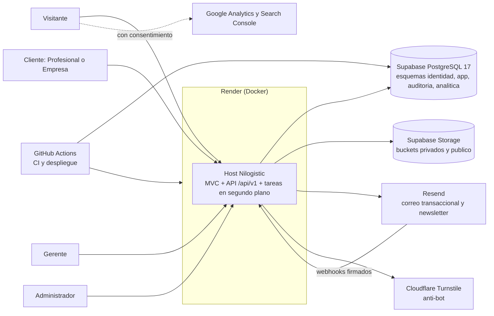
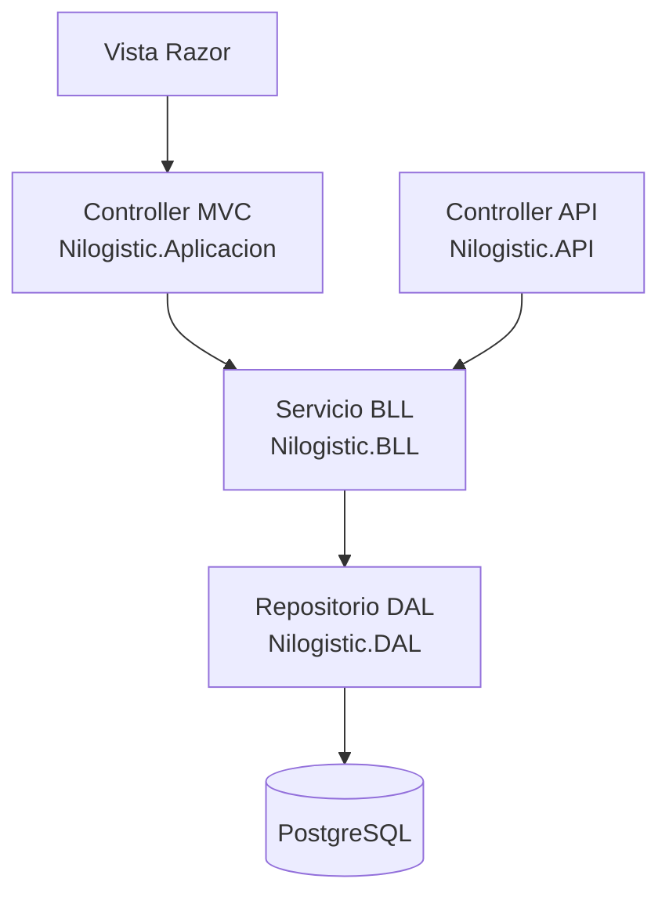
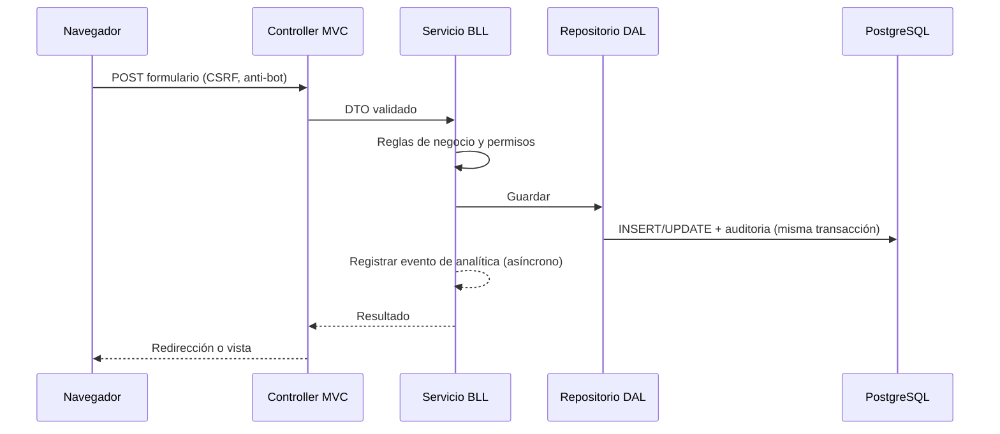

# NILOGISTIC — Fase 5 (A): Arquitectura y decisiones técnicas

| Campo | Valor |
|---|---|
| Versión | 0.1 (borrador para aprobación) |
| Fecha | 05/10/2026 |
| Fase | 5 de 9 — Diseño (documento A de 3) |
| Alcance | Arquitectura y decisiones técnicas para **R1 a R3** (condición de P-304) |
| Entrada | Fase 2 v1.5, Backlog v1.3, Fase 4 Lotes 1 y 2 aprobados |
| Documentos relacionados | (B) Modelo de datos · (C) UX, pantallas y contratos de API |
| Meta de aprobación | 30/10/2026 |

---

## 0. Resumen ejecutivo

Resolví las 14 decisiones técnicas pendientes con hechos verificados el 05/10/2026 (sección 1). **Cuatro de ellas se apartan del diseño inicial y requieren tu aprobación explícita**, porque cambian el stack o la regla de capas:

| # | Decisión | Qué cambia respecto al diseño inicial | Por qué |
|---|---|---|---|
| ADR-01 | El MVC consume la BLL directamente; la API vive en el **mismo host** | Se elimina el salto MVC → API para las páginas del servidor | Un solo servicio, menos código por feature y sin duplicar DTO; la API se conserva para AJAX, webhooks y clientes futuros |
| ADR-04 | **ASP.NET Core Identity** en lugar de Supabase Auth | Supabase queda como PostgreSQL administrado y Storage | Los criterios aprobados (bloqueo por cuenta e IP, 72 h, 12 h absolutas, códigos de respaldo, mínimos en la BLL) son nativos o directos en Identity y no en Supabase Auth |
| ADR-03 | **Migraciones SQL con Supabase CLI** como fuente de verdad; EF Core sin migraciones | Una sola vía de cambio de esquema | RLS, roles, privilegios y particiones no se expresan bien en migraciones de EF |
| ADR-08 | **Planes de pago** desde R1: Render Starter o superior, Supabase Pro y Resend Pro | Se descartan los planes gratuitos en producción | Los gratuitos suspenden el servicio, no hacen respaldos o limitan a 100 correos al día |

Resoluciones que no cambian el diseño: PostgreSQL **17** (no 15), sin tiempo real, tareas en segundo plano dentro del mismo host, auditoría por interceptor de EF Core, almacenamiento con URLs firmadas, y lectura de IP detrás del proxy con IPv6 por /64.

**Si no apruebas ADR-01:** la alternativa estricta (dos servicios, MVC → API → BLL) se describe en la sección 2.1 con su costo estimado.

---

## 1. Hechos verificados (consultados el 05/10/2026)

| # | Hecho | Implicación para Nilogistic | Fuente |
|---|---|---|---|
| H1 | Render suspende un servicio web gratuito tras 15 minutos sin tráfico; el soporte indica que el mínimo para evitarlo es el tipo de instancia de pago Starter | Producción necesita instancia de pago (RNF-DIS-02). Staging puede usar el plan gratuito | docs.render.com/free · community.render.com (hilo de soporte) |
| H2 | En Render, el servicio web con `runtime: docker` se construye desde un Dockerfile | .NET 10 se despliega con Docker; el Dockerfile forma parte del repositorio. Confirmar en el Sprint 0 | render.com (blueprint `render.yaml`) |
| H3 | Supabase Free pausa los proyectos tras 1 semana sin actividad y no incluye respaldos. Pro cuesta 25 USD al mes, no pausa y guarda respaldos diarios 7 días; PITR es un complemento de 100 USD al mes por cada 7 días de retención y exige un complemento de cómputo | Producción necesita Pro. PITR se decide en R2, cuando entren los pagos (ADR-08) | supabase.com/pricing |
| H4 | La conexión directa a la base de datos de Supabase usa IPv6; el *pooler* compartido en modo sesión (puerto 5432) usa IPv4 y admite *prepared statements*; el modo transacción (6543) no los admite | La aplicación usa el pooler en **modo sesión** (ADR-03) | supabase.com/docs/guides/database/connecting-to-postgres |
| H5 | Los proyectos nuevos de Supabase usan Postgres 17; el soporte de Postgres 14 terminó el 01/07/2026 y el fin de vida de Postgres 15 en la plataforma estaba previsto hacia mayo de 2026 | El "PostgreSQL 15" del diseño inicial queda obsoleto: se usa **17** (ADR-07) | supabase.com/changelog (35851 y entradas 2026) |
| H6 | Desde el 30/05/2026 las tablas nuevas del esquema `public` no se exponen por defecto a la Data API, y el 30/10/2026 se aplica a todos los proyectos | Coincide con nuestra postura de denegar por defecto; no usamos la Data API (ADR-03) | supabase.com/changelog |
| H7 | Supabase Auth firma con claves asimétricas por defecto en proyectos creados desde mayo de 2025 y publica un JWKS; ofrece MFA TOTP (nivel `aal2`); la expiración del OTP de correo es configurable (por defecto 1 hora) | Es viable, pero no cubre sin adaptación los criterios aprobados (ADR-04) | supabase.com/docs/guides/auth (JWT, MFA, config) |
| H8 | Resend Free: 3.000 correos al mes, **100 al día** y **1 dominio**. Pro: 20 USD al mes, 50.000 correos, 10 dominios y sin tope diario. Los planes de marketing de Resend se cobran por contactos | Dos subdominios (transaccional y marketing) y newsletters de más de 100 destinatarios exigen **Pro** (ADR-08). Las newsletters se envían por la API transaccional con nuestras propias tablas | resend.com/pricing |
| H9 | .NET 10 es LTS, publicado el 11/11/2025 y con soporte hasta el 10/11/2028; .NET 8 y 9 terminan el 10/11/2026. EF Core 10 es LTS hasta la misma fecha; existe `Npgsql.EntityFrameworkCore.PostgreSQL` 10.0.x | La pila elegida tiene soporte durante todo el horizonte del proyecto | devblogs.microsoft.com/dotnet · nuget.org |

**Pendiente de verificar en el Sprint 0** (no pude confirmarlo con fuentes): precio exacto de Render Starter, cabeceras e IP que entrega el proxy de Render, y la existencia de códigos de respaldo nativos en Supabase MFA (dato que no cambia ADR-04).

---

## 2. Registro de decisiones técnicas (ADR)

| ADR | # | Tema | Decisión | Estado |
|---|---|---|---|---|
| ADR-01 | 1 | Capas y doble salto | MVC → BLL directo; API en el mismo host | **Requiere aprobación** |
| ADR-02 | 2 | Tiempo real | Ninguno en R1 a R3 | Resuelta (D-008) |
| ADR-03 | 3 | Acceso a datos y RLS | EF Core 10 + rol de BD dedicado, RLS de denegación, sin Data API; migraciones SQL | **Requiere aprobación** |
| ADR-04 | 4 | Autenticación | ASP.NET Core Identity con cookie | **Requiere aprobación** |
| ADR-05 | 5 | Auditoría | Interceptor de EF Core en la misma transacción | Propuesta |
| ADR-06 | 6 | Almacenamiento | Supabase Storage con buckets privados y URLs firmadas | Propuesta |
| ADR-07 | 7 | Versión de PostgreSQL | 17 | Propuesta |
| ADR-08 | 8 | Render, planes y despliegue | Docker, instancia de pago en producción, migraciones desde CI | **Requiere aprobación** |
| ADR-09 | 9 | Multi-tenant | No aplica; aislamiento por organización en la BLL | Resuelta (D-007) |
| ADR-10 | 10 | Soft delete | Filtro global de EF + REVOKE DELETE | Resuelta (RN-001) |
| ADR-11 | 11 | Tareas en segundo plano | `BackgroundService` con cola en PostgreSQL | Propuesta |
| ADR-12 | 12 | Editor y sanitización | Quill 2 + HtmlSanitizer en el servidor | Propuesta |
| ADR-13 | 13 | Almacén de analítica | Tabla propia particionada por mes | Propuesta |
| ADR-14 | 14 | IP real e IPv6 | Cabeceras reenviadas con proxy de confianza; /64 | Propuesta |
| ADR-15 | – | Anti-bot | Cloudflare Turnstile | Propuesta |
| ADR-16 | – | Observabilidad | Serilog JSON + monitoreo de disponibilidad | Propuesta |
| ADR-17 | – | Claves de Data Protection | Persistidas en PostgreSQL | Propuesta |

### 2.1 ADR-01 — Capas y doble salto (decisión #1)

**Contexto.** El diseño inicial exige Vista → Controller MVC → API Controller → BLL → DAL. Para un sitio de marketing con módulos privados, desarrollado por una persona, el salto MVC → API duplica trabajo en cada feature y agrega una llamada HTTP por página.

| Criterio | A. Estricta (dos servicios) | **B. MVC → BLL; API en el mismo host (recomendada)** |
|---|---|---|
| Servicios en Render | 2 por entorno | 1 por entorno |
| Código por feature | API + DTO + cliente HTTP + ViewModel + Controller MVC | Servicio BLL + Controller MVC (y API solo si hace falta) |
| Autenticación MVC → API | Hay que propagar la identidad (token interno) | Cookie de sesión, sin propagación |
| Aislamiento de credenciales de BD | El MVC no tiene acceso a la BD | Un solo proceso con acceso a la BD |
| Latencia por página | +1 salto de red | Sin salto |
| Evolución a app móvil o terceros | API ya separada | La API se extrae a otro host sin cambiar la BLL |
| Estimación de esfuerzo | **+25 a +35 SP en R1** (estimación mía) | Base del backlog |

**Decisión recomendada (B).**
- Regla de capas: **Vista → Controller MVC → Servicio BLL → Repositorio DAL → PostgreSQL**. El **Controller API** es una segunda entrada, paralela, al mismo Servicio BLL.
- Ni el MVC ni la API llaman al DAL; la BLL no conoce el framework web; el DAL no tiene lógica de negocio (se mantiene la "regla absoluta" sobre ninguna capa saltada, con la API como entrada paralela).
- `Nilogistic.API` se compila como biblioteca de controladores y se monta en el host de `Nilogistic.Aplicacion` bajo `/api/v1`, con Swagger. Se usa para AJAX (borradores, búsquedas), webhooks (Resend) y futuros clientes.
- Para que la API sea extraíble, sus controladores dependen solo de la BLL y de DTO.

**Consecuencias.** Hay que actualizar las instrucciones del proyecto (sección 7) y las pruebas de arquitectura de HU-001. Se pierde el aislamiento de credenciales entre MVC y datos; se mitiga con el rol de BD de privilegios mínimos (ADR-03).

**Si prefieres la estricta (A):** se mantiene todo el diseño inicial; el costo es +25 a +35 SP en R1 (≈ 1 sprint), un segundo servicio de pago y un mecanismo de propagación de identidad.

### 2.2 ADR-02 — Tiempo real (decisión #2)

Sin tiempo real en R1 a R3 (D-008). No se usan SignalR ni Supabase Realtime. Las notificaciones son por correo. Se reevalúa solo si aparece un requisito concreto (por ejemplo, notificaciones en el sitio, FT-109, R4).

### 2.3 ADR-03 — Acceso a datos, RLS y migraciones (decisiones #3 y #6)

**Decisión.**
1. **ORM:** EF Core 10 con `Npgsql.EntityFrameworkCore.PostgreSQL` 10.0.x; mapeo escrito a mano con Fluent API.
2. **Conexión:** pooler compartido de Supabase en **modo sesión** (puerto 5432, IPv4, *prepared statements* disponibles). Tamaño de pool de Npgsql acotado (por ejemplo, 10) para no agotar el pooler. Si en el Sprint 0 se confirma que Render alcanza IPv6, puede evaluarse la conexión directa.
3. **Roles de BD:** `nilogistic_app` (la aplicación: SELECT, INSERT y UPDATE sobre `app`, `identidad` y `analitica`; solo INSERT y SELECT sobre `auditoria`; **sin DELETE en ninguna tabla**), `nilogistic_migraciones` (dueño del esquema, solo la CI) y, en R4, `nilogistic_bi_lectura` (vistas anonimizadas).
4. **RLS:** habilitado en todas las tablas; política `TO nilogistic_app` y **ninguna política para `anon` ni `authenticated`**. Es defensa en profundidad: aunque se expusiera la Data API, no devolvería filas. El esquema `public` queda vacío y no se expone ningún esquema.
5. **Autorización de negocio:** en la BLL, con filtros globales de EF Core por organización (RN-064) y por `activo` (soft delete).
6. **Service role:** la clave solo existe en el servidor y solo para Storage; nunca en el navegador ni en el repositorio.
7. **Migraciones:** archivos SQL versionados en `/supabase/migrations`, aplicados con Supabase CLI desde la CI. EF Core **no** genera migraciones. Una prueba de integración (Testcontainers con PostgreSQL 17) aplica las migraciones y ejercita cada entidad para detectar desfases entre el esquema y el modelo.

**Consecuencias.** Se renuncia a las migraciones automáticas de EF; a cambio, RLS, roles, privilegios, particiones e índices parciales quedan bajo control versionado.

### 2.4 ADR-04 — Autenticación (decisión #4)

**Contexto.** El diseño inicial usa Supabase Auth con JWT. Los criterios aprobados en las HU son detallados y se aplican por rol.

| Criterio aprobado | Supabase Auth | ASP.NET Core Identity (recomendada) |
|---|---|---|
| Enlace de activación de 72 h, un solo uso (HU-016) | La expiración del OTP es configurable (por defecto 1 h); el máximo debe verificarse | Vigencia por tipo de token, configurable |
| Bloqueo por cuenta e IP, desafío a los 10 y bloqueo a los 20, mensajes genéricos (HU-018) | Límites de tasa propios del servicio, no por cuenta con esta política | Bloqueo nativo por cuenta + limitador de frecuencia de ASP.NET Core por IP |
| Inactividad de 15 o 30 min por rol y 12 h absolutas (HU-015) | Controles de sesión de proyecto, no por rol | Cookie con expiración deslizante y validación por rol |
| 2FA TOTP con 10 códigos de respaldo y reinicio auditado (HU-021 y HU-022) | TOTP disponible (Pro); códigos de respaldo por verificar | TOTP y códigos de respaldo nativos |
| Parámetros en FT-099 con mínimos validados en la BLL (HU-062) | Se configuran en el panel de Supabase, fuera de nuestra aplicación | Se leen del almacén de parámetros |
| Auditoría de eventos de seguridad en nuestra tabla, atómica (HU-008) | Registro propio de Supabase, no integrado | Misma transacción y misma tabla |
| Correos con plantillas de HU-030 vía Resend | SMTP personalizado y plantillas en el panel | `IEmailSender` propio sobre la cola de HU-010 |

**Decisión recomendada.** ASP.NET Core Identity con autenticación por **cookie** (HttpOnly, Secure, SameSite=Lax). Supabase se usa como PostgreSQL administrado y Storage; no se usan Supabase Auth, Realtime, Edge Functions ni PostgREST.

**Adaptaciones obligatorias de Identity** (riesgos que debo señalar):
- Identity guarda por defecto los códigos de respaldo y la clave del autenticador en `UserTokens` en claro: se personaliza el almacén para guardar **hash** de los códigos y **cifrar** el secreto (Q-402, HU-021).
- Las claves de Data Protection se **persisten en PostgreSQL** (ADR-17); si no, cada despliegue en Render invalidaría cookies y enlaces.
- Los hashes de contraseña y la política se ajustan según RN-069.

**Consecuencias.** Asumimos el mantenimiento de la capa de identidad y su seguridad (pruebas dedicadas en G3). A cambio, los criterios aprobados se cumplen sin concesiones. Si prefieres Supabase Auth, varios criterios de las HU-014 a HU-022 y HU-062 deberían renegociarse.

### 2.5 ADR-05 — Auditoría (decisión #5)

- **Mecanismo:** `SaveChangesInterceptor` de EF Core que, dentro de la misma transacción, escribe en `auditoria.registros` los valores antes y después de cada entidad añadida o modificada (RN-060). Los campos sensibles se excluyen con un atributo `[NoAuditar]`.
- **Contexto:** un servicio por solicitud (`IContextoAuditoria`) aporta usuario, rol, IP, user agent y correlación; las tareas en segundo plano usan el actor "Sistema".
- **Eventos de seguridad** (login, bloqueo, 2FA, acceso denegado): se registran con un servicio explícito en la misma transacción cuando existe, o de forma inmediata cuando no hay cambio de datos.
- **Inmutabilidad:** `nilogistic_app` solo tiene INSERT y SELECT sobre `auditoria` (HU-009). Se descartan los *triggers* de PostgreSQL como mecanismo principal porque no conocen al usuario de la aplicación.
- **Volumen:** tabla particionada por mes e índices por fecha, usuario y entidad.

### 2.6 ADR-06 — Almacenamiento (decisión #6)

| Bucket | Acceso | Contenido | Límite | Entrega |
|---|---|---|---|---|
| `editorial-publico` | Público (solo lectura) | Portadas e imágenes de Blog, Eventos y Newsletter | JPG, PNG, WebP; 2 MB | URL pública |
| `perfiles` | Privado | Fotos de perfil | 1 MB | URL firmada, 15 min |
| `comprobantes-pago` (R2) | Privado | Comprobantes de transferencia | PDF, JPG, PNG; 5 MB | URL firmada, 5 min, solo a Administración y al dueño |
| `cv-profesional` (R2) | Privado | CVs | PDF; 5 MB | URL firmada, 5 min, solo a empresas con postulación |
| `facturas` (R2) | Privado | PDF de facturas | PDF; 5 MB | URL firmada, 5 min |
| `material-cursos` (R3) | Privado | Material de cursos | Según tipo | URL firmada, 15 min |
| `descargas-digitales` (R3) | Privado | Libros y herramientas | Según tipo | URL firmada, 5 min con límite de descargas |

Reglas: la validación de tipo usa la firma real del archivo y no la extensión; los nombres de archivo se regeneran (UUID); el acceso siempre pasa por la BLL, que comprueba permisos antes de firmar; se registra cada descarga de comprobante (RF-AUD-02). El análisis antivirus no está en el alcance de R1; se evalúa en R2 por el riesgo de comprobantes y CVs.

### 2.7 ADR-07 — PostgreSQL (decisión #7)

Se usa **PostgreSQL 17**, la versión de los proyectos nuevos de Supabase (H5). Al crear el proyecto se registra la versión exacta en el README de entornos (HU-003). Extensiones previstas: `pgcrypto` o funciones integradas para UUID, `citext` para correos y `unaccent` con `pg_trgm` para búsqueda del Blog. No se usan `timescaledb`, `plv8` ni `pgjwt`, retiradas en PG 17.

### 2.8 ADR-08 — Render, planes y despliegue (decisión #8)

| Entorno | Hosting | Base de datos | Correo | Notas |
|---|---|---|---|---|
| Local | Docker Compose (app + Postgres 17) | Postgres local con migraciones | Buzón de pruebas | Sin servicios externos |
| Staging | Render (puede ser plan gratuito) | Proyecto Supabase aparte (puede ser Free) | Resend en modo prueba | Sin indexación (HU-068); la suspensión es aceptable |
| Producción | Render, instancia de pago (mínimo Starter) | Supabase **Pro** | Resend **Pro** | Sin suspensión; *health check* en `/health/ready` |

**Costos mensuales verificados (USD):** Supabase Pro 25; Resend Pro 20; PITR opcional 100 más el complemento de cómputo que exige. Render Starter: **a confirmar en el panel**. Total verificado sin Render: **45**, sin PITR.

**Respaldos y recuperación.**
- R1: respaldos diarios de Supabase Pro (RPO hasta 24 h) más un respaldo lógico semanal y uno antes de cada migración de producción. Objetivos: RPO 24 h, RTO 4 h.
- **R2 (pagos y comprobantes): evaluar PITR** para bajar el RPO a minutos. Es una decisión de costo (100 USD al mes) que traigo como P-308.

**Despliegue.**
1. GitHub Actions: compilación, pruebas y análisis en cada PR; el merge exige CI en verde (HU-005).
2. Merge a `develop`: aplica migraciones a Staging con Supabase CLI y dispara el despliegue de Render.
3. Versión etiquetada desde `main`: **aprobación manual** (GitHub Environments), migraciones a Producción, despliegue, pruebas de humo y verificación de `/health/ready` (HU-006).
4. Migraciones **fuera del arranque de la aplicación**: nunca se ejecutan al iniciar el contenedor.
5. Flujo de ramas: GitFlow ligero (`main`, `develop`, `feature/*`, `hotfix/*`) y Conventional Commits.

### 2.9 ADR-09 y ADR-10 — Multi-tenant y soft delete (decisiones #9 y #10)

- **Multi-tenant:** no aplica (D-007). La organización es un dato del negocio. El aislamiento (RN-064) se aplica en la BLL con filtros globales de EF Core que añaden `organizacion_id`.
- **Soft delete:** toda entidad hereda `Activo`; el filtro global excluye inactivos por defecto y existe una opción explícita para incluirlos (RF-BI-09). El rol de BD no tiene DELETE (HU-007).

### 2.10 ADR-11 — Tareas en segundo plano (decisión #11)

**Decisión.** `BackgroundService` dentro del mismo host, con una tabla de tareas y de ejecuciones, y bloqueo con `SELECT … FOR UPDATE SKIP LOCKED` o *advisory locks* de PostgreSQL, de modo que una sola instancia ejecute cada tarea (HU-034).

| Opción | Ventaja | Desventaja |
|---|---|---|
| **BackgroundService propio (recomendada)** | Sin dependencias ni servicio extra; cubre cola de correo, publicaciones programadas y limpiezas | Hay que escribir reintentos, registro y alertas (están en HU-034 y HU-035) |
| Hangfire con almacenamiento PostgreSQL | Reintentos y panel listos | Dependencia adicional y un panel que hay que proteger |
| Worker separado en Render | Aislamiento | Segundo servicio de pago |

Se puede pasar a Hangfire o a un worker separado si las necesidades crecen (R2: vencimientos, recordatorios).

### 2.11 ADR-12 — Editor y sanitización (decisión #12)

- **Editor:** **Quill 2** autoalojado (licencia BSD, sin dependencia de jQuery, compatible con CSP). **Verificar la licencia de la versión elegida**; se descartan editores con licencia GPL o comercial para evitar obligaciones de licenciamiento.
- **Sanitización:** en el servidor con una lista blanca (por ejemplo, HtmlSanitizer, licencia MIT), definida en CV-08; es obligatoria en todo contenido enriquecido antes de guardar y también al renderizar contenido heredado.
- **Imágenes:** subida validada (HU-048); redimensionado en el servidor con una biblioteca de licencia compatible (a verificar en el Sprint 4).

### 2.12 ADR-13 — Almacén de analítica (decisión #13)

- Tabla propia `analitica.eventos` particionada por mes, con catálogo de eventos (HU-070) e identificador seudonimizado por HMAC.
- Tabla `analitica.eventos_agregado_mensual` para la agregación previa a la eliminación (Q-504).
- Google Analytics se usa en paralelo solo para tráfico web y siempre con consentimiento (HU-066). Los tableros de Administración leen **nuestra** tabla.
- Volumen estimado de R1 bajo (miles de eventos al mes): sin impacto relevante en el plan de Supabase.

### 2.13 ADR-14 — IP real e IPv6 (decisión #14)

- `ForwardedHeaders` configurado para aceptar `X-Forwarded-For` solo del proxy de confianza; cualquier cabecera enviada directamente por el cliente se ignora (HU-013 E5).
- Para límites y bloqueos, IPv6 se agrupa por **/64** (HU-013 E6 y HU-018 E7). La auditoría guarda la IP completa.
- **Spike del Sprint 0:** confirmar con una petición real en Staging qué cabeceras y rangos entrega el proxy de Render, antes de fijar la red de confianza.
- DNS: se recomienda gestionarlo en un proveedor independiente en modo "solo DNS" (sin proxy), para no añadir un segundo proxy que cambie la IP del cliente.

### 2.14 ADR-15, ADR-16 y ADR-17 — Otros

| ADR | Decisión | Nota |
|---|---|---|
| ADR-15 Anti-bot | **Cloudflare Turnstile**, con verificación en el servidor y alternativa accesible (HU-013) | Verificar términos del plan gratuito; la CSP debe permitir su dominio |
| ADR-16 Observabilidad | **Serilog** con salida JSON a la consola (logs de Render); correlación por solicitud; monitoreo externo de `/health/live`; captura de errores con una herramienta tipo Sentry (decisión menor, Sprint 0) | Sin datos personales en logs (DoD-07) |
| ADR-17 Data Protection | Claves guardadas en PostgreSQL y protegidas con una clave de aplicación guardada como secreto | Sin esto, los despliegues invalidan cookies y enlaces |

---

## 3. Arquitectura

### 3.1 Contexto y contenedores



### 3.2 Capas y reglas de referencia (ADR-01)



| Proyecto | Puede referenciar | No puede referenciar | Contiene |
|---|---|---|---|
| `Nilogistic.Aplicacion` (host MVC) | BLL, DTO, Utility, IOC, API | DAL, Entity | Areas, Controllers, ViewModels, Views, wwwroot, pipeline de seguridad |
| `Nilogistic.API` (biblioteca de controladores) | BLL, DTO, Utility | DAL, Entity, Aplicacion | Controllers REST, Swagger, validadores de entrada |
| `Nilogistic.BLL` | Interfaces del DAL, Entity, DTO, Utility | Aplicacion, API, EF Core | Servicios, reglas de negocio, FluentValidation, autorización de negocio |
| `Nilogistic.DAL` | Entity, Utility | BLL, DTO, Aplicacion, API | DbContext, repositorios, interceptor de auditoría, mapeo |
| `Nilogistic.Entity` | – | Todos | Entidades de dominio |
| `Nilogistic.DTO` | – | Todos | Request y Response |
| `Nilogistic.IOC` | Todos (solo composición) | – | Registro de dependencias |
| `Nilogistic.Utility` | – | Todos | Constantes, extensiones y **adaptadores externos** (Resend, Storage, Turnstile) detrás de interfaces |

Estas reglas se verifican con las pruebas de arquitectura de HU-001.

### 3.3 Flujo de una solicitud con auditoría y analítica



### 3.4 Responsabilidades transversales

| Aspecto | Dónde vive | HU |
|---|---|---|
| Identidad, sesión y 2FA | Pipeline de `Aplicacion` + `IServicioIdentidad` (BLL) | HU-014 a HU-022 |
| Autorización por rol, módulo y objeto | `IServicioAutorizacion` (BLL) y atributos en controladores | HU-019, HU-020 |
| Validación | FluentValidation en BLL; jQuery Validate en la vista | CV-05 |
| Auditoría | Interceptor en DAL | HU-008, HU-009 |
| Analítica | `IServicioAnalitica` (BLL) con cola | HU-069, HU-070 |
| Correo | `IServicioCorreo` (BLL) → cola persistida → Resend (Utility) | HU-010, HU-030 |
| Parámetros | `IServicioParametros` (BLL) con caché e invalidación | HU-062 |
| Archivos | `IServicioArchivos` (BLL) → Storage (Utility) | ADR-06 |
| Tareas | `BackgroundService` en `Aplicacion` | HU-034, HU-035 |
| Errores | Middleware con ProblemDetails y correlación | CV-06, HU-046 |

### 3.5 Estructura de la solución

```
Nilogistic.sln
├── src/
│   ├── Nilogistic.Aplicacion/   Areas/{Publico,Cuenta,Administracion,Contenido}/ ... wwwroot/
│   ├── Nilogistic.API/          Controllers/V1/
│   ├── Nilogistic.BLL/          Interfaces/, Servicios/, Validadores/
│   ├── Nilogistic.DAL/          Contexto/, Interfaces/, Repositorios/, Interceptores/, Mapeos/
│   ├── Nilogistic.Entity/
│   ├── Nilogistic.DTO/
│   ├── Nilogistic.IOC/
│   └── Nilogistic.Utility/      Contratos/, Externos/, Extensiones/
├── tests/
│   ├── Nilogistic.BLL.Tests/    xUnit + Moq + FluentAssertions
│   ├── Nilogistic.DAL.Tests/    Testcontainers PostgreSQL 17
│   └── Nilogistic.Arquitectura.Tests/
├── supabase/
│   ├── migrations/              SQL versionado (fuente de verdad del esquema)
│   └── seed.sql
├── .github/workflows/           ci.yml, deploy-staging.yml, deploy-prod.yml
├── Dockerfile
└── render.yaml
```

Áreas MVC (sustituyen a las del diseño inicial heredado):

| Área | Contenido |
|---|---|
| `Publico` | Inicio, Quiénes Somos, Servicios, Blog, Eventos, Contacto, páginas legales, solicitud de alta, suscripción |
| `Cuenta` | Login, activación, recuperación, 2FA, perfil |
| `Administracion` | Usuarios, permisos, solicitudes, catálogos, configuración, auditoría, tareas, eventos |
| `Contenido` | Posts, categorías y newsletters (Gerente y Administrador) |
| `Empleo`, `Publicidad`, `Cursos`, `Tienda` (R2 y R3) | Módulos privados |

---

## 4. Seguridad

### 4.1 Amenazas principales y controles

| # | Amenaza | Controles | HU / ADR |
|---|---|---|---|
| T1 | Fuerza bruta y *credential stuffing* | Bloqueo por cuenta e IP, desafío anti-bot, 2FA obligatorio en gestión | HU-013, HU-018, HU-022 |
| T2 | Enumeración de cuentas | Mensajes genéricos y tiempos comparables | CV-01, HU-014 |
| T3 | XSS en contenido editorial | Sanitización en servidor, CSP con nonce | ADR-12, HU-012, HU-048 |
| T4 | CSRF | Token antifalsificación y SameSite | HU-013 |
| T5 | Acceso a datos de otro cliente u organización (IDOR) | Autorización por objeto, filtros por organización, pruebas negativas | HU-020, ADR-09 |
| T6 | Archivos maliciosos | Validación por firma real, nombres UUID, buckets privados, antivirus en R2 | ADR-06 |
| T7 | Inyección SQL | EF Core parametrizado, sin SQL dinámico | ADR-03 |
| T8 | Abuso de formularios y *backscatter* | Anti-bot, límites por IP y por correo destino | HU-043, HU-053 |
| T9 | Fuga de secretos | Variables de entorno, escaneo de secretos en CI, rotación | HU-005, sección 4.5 |
| T10 | Relajar la seguridad por configuración | Mínimos validados en la BLL, reautenticación 2FA y aviso | RN-069, HU-062 |
| T11 | Manipulación de la auditoría | Solo INSERT y SELECT para la aplicación | HU-009 |
| T12 | Toma de cuenta de Administrador | 2FA, mínimo de 2 Administradores, emergencia auditada | RN-067, HU-033 |
| T13 | Secuestro de sesión | Cookie HttpOnly, Secure y SameSite; expiración; sello de seguridad | HU-015, ADR-04 |
| T14 | Redirección abierta | URL de retorno solo interna | HU-014 E4 |
| T15 | Dependencias vulnerables | Escaneo en CI | HU-005 |
| T16 | Exposición accidental de la base de datos | RLS de denegación, esquema `public` vacío, sin Data API | ADR-03, HU-004 |

### 4.2 OWASP Top 10 (2021)

| Categoría | Cobertura |
|---|---|
| A01 Control de acceso | T5, ADR-03, ADR-04, HU-019 y HU-020 |
| A02 Fallas criptográficas | HTTPS y HSTS, hash de contraseñas y de códigos de respaldo, secreto 2FA cifrado, Data Protection (ADR-17) |
| A03 Inyección | T3 y T7 |
| A04 Diseño inseguro | Modelo de amenazas, RN-069 y RN-067 |
| A05 Configuración incorrecta | Cabeceras y CSP (HU-012), parámetros con mínimos |
| A06 Componentes vulnerables | T15 |
| A07 Autenticación | ADR-04, 2FA, bloqueo |
| A08 Integridad de software y datos | CI/CD con aprobación manual, firma de webhooks (HU-065), SRI |
| A09 Registro y monitoreo | Auditoría, Serilog, alertas (HU-035) |
| A10 SSRF | La aplicación no solicita URLs proporcionadas por usuarios; las llamadas salientes van a destinos fijos |

### 4.3 Política de CSP (borrador, se prueba en modo reporte en Staging)

```
default-src 'self';
script-src 'self' 'nonce-{n}' https://challenges.cloudflare.com;   # + dominios de Analytics solo con consentimiento
style-src 'self' 'nonce-{n}';
img-src 'self' data: https://{proyecto}.supabase.co;               # buckets públicos
connect-src 'self';
frame-src https://challenges.cloudflare.com;
font-src 'self'; object-src 'none'; base-uri 'self'; form-action 'self'; frame-ancestors 'none'
```

### 4.4 Sesión y límites

| Elemento | Valor |
|---|---|
| Cookie de sesión | HttpOnly, Secure, SameSite=Lax |
| Inactividad | 30 min (clientes), 15 min (Gerente y Administrador); duración absoluta máxima 12 h |
| Validación del sello de seguridad | Cada 1 minuto (la contraseña cambiada invalida otras sesiones) |
| Login por cuenta | 5 fallos en 15 min → bloqueo 15 min |
| Login por IP | 10 fallos → desafío anti-bot; 20 → bloqueo 15 min (IPv6 por /64) |
| Recuperación | 5 por hora por IP y 3 por hora por correo |
| Solicitud de alta | 5 por hora por IP |
| Contacto | 5 por hora por IP; 3 acuses por día por correo destino |
| Suscripción | 5 por hora por IP y 3 por hora por correo |
| Paso 2FA | 5 fallos → bloqueo 15 min |
| Pruebas de newsletter | 10 por hora por usuario |
| API autenticada | 120 por minuto por usuario (propuesta) |

Los valores salen del almacén de parámetros (HU-062), con los mínimos de RN-069.

### 4.5 Secretos

| Secreto | Dónde vive | Quién lo usa |
|---|---|---|
| Cadena de conexión de `nilogistic_app` | Variable de entorno de Render | Aplicación |
| Cadena de conexión de migraciones | Secreto de GitHub (entorno) | Solo CI |
| Clave *service role* de Storage | Variable de entorno de Render | Aplicación (solo Storage) |
| Clave API y secreto de webhook de Resend | Variable de entorno de Render | Aplicación |
| Secreto de Turnstile | Variable de entorno de Render | Aplicación |
| Clave HMAC de analítica | Variable de entorno de Render | Aplicación |
| Clave de protección de Data Protection | Variable de entorno de Render | Aplicación |

Ninguno entra en el repositorio. Se rotan al cambiar de responsable y ante cualquier sospecha de filtración.

### 4.6 Clasificación de datos y retención (propuesta; validar con asesoría legal, tarea #6)

| Dato | Clase | Retención propuesta |
|---|---|---|
| Contraseñas, secretos 2FA, códigos de respaldo | Secreto | Mientras la cuenta esté activa; solo hash o cifrado |
| Datos de contacto y solicitudes de alta | Confidencial | Aprobadas: vida de la cuenta. Rechazadas: 12 meses. Anonimización según RN-004 |
| Evidencia de consentimiento (Newsletter, legales) | Confidencial | Mientras dure el tratamiento y el plazo legal aplicable |
| Auditoría | Interno | 5 años (a validar) |
| Eventos de analítica | Interno | 24 meses y luego agregación mensual (RN-071) |
| Comprobantes y facturas (R2) | Confidencial financiero | Plazo fiscal vigente (a validar con contabilidad) |
| Mensajes de contacto con fallo definitivo | Confidencial | 30 días |

---

## 5. Rendimiento y operación

| Tema | Diseño |
|---|---|
| Presupuesto web | LCP ≤ 2,5 s, INP ≤ 200 ms, CLS ≤ 0,1 (RNF-REN-01); p95 de API ≤ 500 ms |
| Caché de páginas públicas | Caché de salida de 60 a 300 s para Inicio, Blog, Eventos y legales, con invalidación al publicar |
| Caché de parámetros | En memoria, invalidada al guardar un cambio |
| Recursos estáticos | Nombres con huella digital, caché larga, compresión Brotli |
| Imágenes | WebP, tamaños responsivos y carga diferida |
| Salud | `/health/live` y `/health/ready` (HU-002) |
| Alertas | Caída de `/health/ready` por 2 min, tareas fallidas (HU-035), cola de correo creciente, tasa de errores 5xx |
| Disponibilidad | 99,5 % mensual en el sitio público (RNF-DIS-01) |
| Degradación | Si Resend falla, el correo queda en cola y se reintenta; si Storage falla, se muestran solo los contenidos sin imagen |

---

## 6. Riesgos y decisiones para aprobar

| # | Riesgo | Mitigación |
|---|---|---|
| RA-1 | La personalización de Identity (hash de códigos, cifrado del secreto) introduce errores de seguridad | Pruebas dedicadas en G3; revisión de código; HU-021 con escenarios de cifrado |
| RA-2 | Render no entrega la IP real como se espera | Spike del Sprint 0 (ADR-14) |
| RA-3 | Capacidad de una persona frente a 265 SP en R1 | ADR-01 reduce el esfuerzo; el sprint final no lleva features |
| RA-4 | Límites de conexiones del pooler de Supabase | Pool de Npgsql acotado; monitoreo |
| RA-5 | Resend Free configurado por error en producción | Verificación en G5; alerta si se acerca al tope diario |
| RA-6 | Caída de Supabase o Resend | Cola de correo con reintentos; páginas públicas con caché |
| RA-7 | Licencias del editor y de librerías de imagen | Verificación al elegir versión (ADR-12) |
| RA-8 | Respaldo de 24 h insuficiente cuando entren los pagos | Decisión de PITR en R2 (P-308) |

### 6.1 Decisiones que necesito de ti

| # | Decisión | Propuesta |
|---|---|---|
| **DA-1** | ADR-01: MVC → BLL directo con API en el mismo host | Aprobar (B); alternativa estricta con +25 a +35 SP |
| **DA-2** | ADR-04: ASP.NET Core Identity en lugar de Supabase Auth | Aprobar |
| **DA-3** | ADR-03: migraciones SQL como fuente de verdad y EF sin migraciones | Aprobar |
| **DA-4** | ADR-08: Supabase Pro y Resend Pro desde R1 y Render de pago en producción | Aprobar el gasto de 45 USD al mes más Render |
| **DA-5** | P-308: PITR en R2 (100 USD al mes) | Decidir antes del Lote 3 |
| **DA-6** | ADR-11: tareas con `BackgroundService` propio frente a Hangfire | Aprobar la opción propia |
| **DA-7** | ADR-12 y ADR-15: Quill 2 y Cloudflare Turnstile | Aprobar |

### 6.2 Trazabilidad ADR → HU afectadas

| ADR | HU |
|---|---|
| ADR-01 | HU-001, HU-002 y todas las que mencionan "Controller MVC → BLL" |
| ADR-03 | HU-003, HU-004, HU-007, HU-038 |
| ADR-04 | HU-014 a HU-022, HU-033, HU-062 |
| ADR-05 | HU-008, HU-009, HU-064 |
| ADR-06 | HU-004, HU-047, HU-048 |
| ADR-08 | HU-005, HU-006, HU-011 |
| ADR-11 | HU-034, HU-035 |
| ADR-12 | HU-048, HU-055 |
| ADR-13 | HU-069, HU-070 |
| ADR-14 | HU-013, HU-018 |
