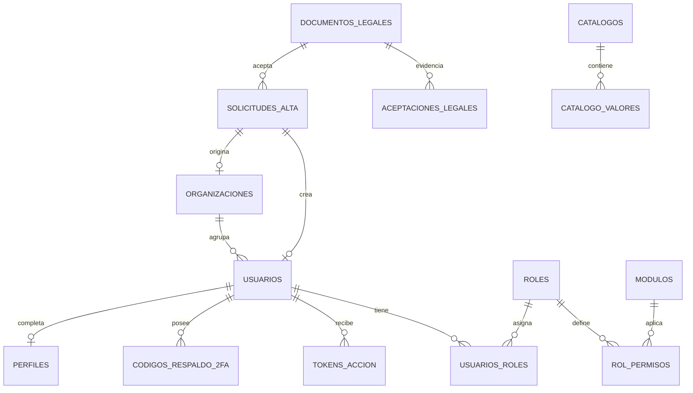
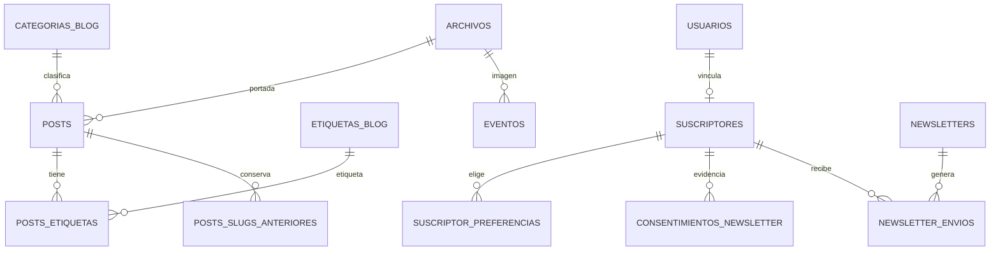
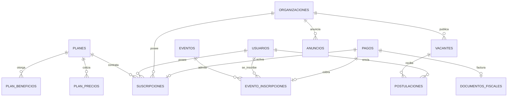
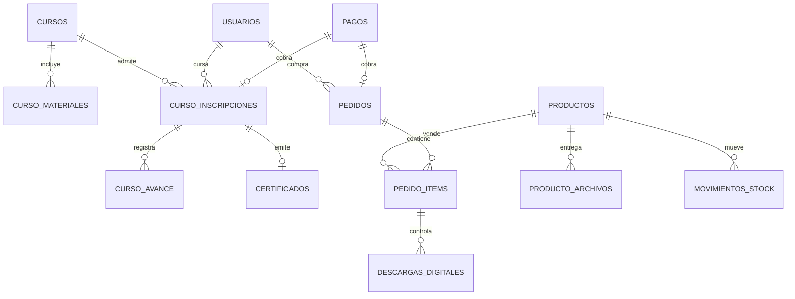

# NILOGISTIC — Fase 5 (B): Modelo de datos R1 a R3

| Campo | Valor |
|---|---|
| Versión | 0.1 (borrador para aprobación) |
| Fecha | 05/10/2026 |
| Fase | 5 de 9 — Diseño (documento B de 3) |
| Alcance | **R1 en detalle y listo para escribir migraciones** (40 tablas); R2 (15 tablas) y R3 (11 tablas) a nivel lógico, como pide P-304 |
| Entrada | ADR-03, ADR-04, ADR-05, ADR-06, ADR-07, ADR-13 del documento A; Fase 2 v1.5; HU de los Lotes 1 y 2 |
| Meta de aprobación | 30/10/2026 |

---

## 1. Convenciones

### 1.1 Nomenclatura y tipos

| Aspecto | Regla |
|---|---|
| Nombres | Español, `snake_case`, tablas en plural; esquemas `identidad`, `app`, `auditoria` y `analitica`. En C#, entidades en singular y `PascalCase` (por ejemplo `Usuario`, `SolicitudAlta`) |
| Claves | `uuid` generado en la base (`gen_random_uuid()`, integrado en PostgreSQL 17); `bigint identity` solo en tablas de alto volumen (auditoría, analítica, ejecuciones) |
| Fechas | `timestamptz`, siempre en UTC (CV-02); `date` solo para fechas sin hora (vigencias, tipo de cambio) |
| Texto | `text`; correos con `citext`; las listas cerradas con `CHECK` y no con tipos enumerados, para facilitar la evolución |
| Dinero | `numeric(14,2)` más `moneda char(3)` (`NIO` o `USD`); tipo de cambio `numeric(12,6)` |
| Concurrencia | Control optimista con la columna de sistema `xmin` de PostgreSQL mapeada como *concurrency token* en EF Core (HU-048 E5) |
| Soft delete | `activo boolean`; el filtro global de EF excluye inactivos; el rol de la aplicación no tiene DELETE (HU-007) |
| Búsqueda | `tsvector` generado con diccionario `spanish` más `unaccent` para el Blog |
| Particionado | Declarativo por mes en `auditoria.registros`, `analitica.eventos` (y evaluar `tareas_ejecuciones`) |

### 1.2 Columnas base

Las tablas marcadas con *(columnas base)* incluyen, además de las propias:

| Columna | Tipo | Restricción |
|---|---|---|
| id | uuid | PK, defecto gen_random_uuid() |
| activo | bool | NOT NULL, defecto true |
| creado_utc | timestamptz | NOT NULL, defecto now() |
| actualizado_utc | timestamptz | NOT NULL |
| creado_por | uuid | NULL |
| actualizado_por | uuid | NULL |

Las tablas de solo inserción (auditoría, evidencias, analítica) y las de clave compuesta no llevan columnas base.

### 1.3 Esquemas y roles de base de datos

| Esquema | Contenido | `nilogistic_app` | `anon` y `authenticated` |
|---|---|---|---|
| `identidad` | Usuarios, roles, tokens y claves de protección | SELECT, INSERT, UPDATE | Sin acceso |
| `app` | Negocio | SELECT, INSERT, UPDATE | Sin acceso |
| `auditoria` | Bitácora | **SELECT, INSERT** | Sin acceso |
| `analitica` | Eventos y agregados | SELECT, INSERT, UPDATE (agregados) | Sin acceso |
| `public` | Vacío; no se expone ningún esquema por la Data API | – | Sin acceso |

Ninguna tabla concede DELETE a `nilogistic_app`. Las limpiezas de retención (borradores, analítica, cola de correo) las ejecuta el rol de migraciones desde tareas controladas o se implementan como funciones `SECURITY DEFINER` acotadas; es un punto a resolver en el Sprint 0 (decisión DB-1).

---

## 2. SQL de convenciones críticas (base para las primeras migraciones)

```sql
-- Extensiones y esquemas
create extension if not exists citext;
create extension if not exists unaccent;
create extension if not exists pg_trgm;
create schema if not exists identidad; create schema if not exists app;
create schema if not exists auditoria; create schema if not exists analitica;

-- Rol de la aplicación: privilegios mínimos, sin DELETE
-- La contraseña se asigna fuera de la migración (secreto de Render); nunca en el repositorio
create role nilogistic_app login nosuperuser nocreatedb nocreaterole;
grant usage on schema identidad, app, auditoria, analitica to nilogistic_app;
grant select, insert, update on all tables in schema identidad, app, analitica to nilogistic_app;
grant select, insert on all tables in schema auditoria to nilogistic_app;
alter default privileges in schema identidad, app, analitica grant select, insert, update on tables to nilogistic_app;
alter default privileges in schema auditoria grant select, insert on tables to nilogistic_app;
revoke all on schema public from anon, authenticated;

-- Plantilla de tabla de negocio con RLS de denegación (HU-004)
create table app.categorias_blog (
  id uuid primary key default gen_random_uuid(),
  nombre text not null, slug text not null unique, descripcion text,
  activo boolean not null default true,
  creado_utc timestamptz not null default now(), actualizado_utc timestamptz not null default now(),
  creado_por uuid, actualizado_por uuid
);
create unique index ux_categorias_blog_nombre on app.categorias_blog (lower(nombre));
alter table app.categorias_blog enable row level security;
create policy app_acceso on app.categorias_blog for all to nilogistic_app using (true) with check (true);
-- Sin políticas para anon ni authenticated: denegado por defecto

-- Un solo documento legal vigente por tipo (HU-032 E3)
create unique index ux_documentos_legales_vigente on app.documentos_legales (tipo) where vigente_hasta_utc is null;

-- Auditoría inmutable y particionada (HU-009)
create table auditoria.registros (
  id bigint generated always as identity, ocurrio_utc timestamptz not null,
  tipo text not null check (tipo in ('gestion','seguridad')), usuario_id uuid, rol text,
  accion text not null, entidad text not null, entidad_id text,
  antes jsonb, despues jsonb, ip inet, user_agent text, correlacion_id text, detalle jsonb,
  primary key (id, ocurrio_utc)
) partition by range (ocurrio_utc);
alter table auditoria.registros enable row level security;
create policy auditoria_lectura on auditoria.registros for select to nilogistic_app using (true);
create policy auditoria_insercion on auditoria.registros for insert to nilogistic_app with check (true);
-- Sin UPDATE ni DELETE: ni privilegio ni política

-- Búsqueda del Blog
-- posts.busqueda: tsvector generado con to_tsvector('spanish', unaccent(titulo || ' ' || resumen)) e índice GIN
```

---

## 3. Diagramas entidad-relación

### 3.1 Identidad, solicitudes y organizaciones (R1)



### 3.2 Contenido, Newsletter y Eventos (R1)



### 3.3 Membresías, pagos, empleo y publicidad (R2, lógico)



### 3.4 Cursos y comercio (R3, lógico)



---

## 4. Diccionario de tablas de R1

### Esquema `identidad`

#### `identidad.usuarios` — Usuario de ASP.NET Core Identity (clientes, Gerente y Administrador)

Release: R1 · HU: HU-014 a HU-023

| Columna | Tipo | Restricción / nota |
|---|---|---|
| *(columnas base)* | – | Ver sección 1.2 |
| email | citext | NOT NULL, único |
| email_normalizado | text | NOT NULL, único |
| email_confirmado | bool | NOT NULL, defecto false |
| password_hash | text | NULL hasta activar |
| security_stamp | text | NOT NULL |
| concurrency_stamp | text | NOT NULL |
| telefono | text | NULL |
| dos_factores_habilitado | bool | NOT NULL, defecto false |
| bloqueo_fin_utc | timestamptz | NULL |
| bloqueo_habilitado | bool | NOT NULL, defecto true |
| intentos_fallidos | int | NOT NULL, defecto 0 |
| cuenta_activada_utc | timestamptz | NULL |
| tipo_cuenta | text | CHECK Profesional, Empresa, Gerente, Administrador |
| organizacion_id | uuid | FK organizaciones, NULL |
| es_principal | bool | NOT NULL, defecto false |
| ultimo_acceso_utc | timestamptz | NULL |

Índices y restricciones: UQ(email_normalizado); IDX(organizacion_id); UQ parcial (organizacion_id) WHERE es_principal

#### `identidad.roles` — Roles: Cliente-Profesional, Cliente-Empresa, Gerente, Administrador

Release: R1 · HU: HU-019

| Columna | Tipo | Restricción / nota |
|---|---|---|
| *(columnas base)* | – | Ver sección 1.2 |
| nombre | text | NOT NULL, único |
| nombre_normalizado | text | NOT NULL, único |
| concurrency_stamp | text | NOT NULL |

#### `identidad.usuarios_roles` — Relación usuario-rol

Release: R1 · HU: HU-019

| Columna | Tipo | Restricción / nota |
|---|---|---|
| usuario_id | uuid | PK, FK |
| rol_id | uuid | PK, FK |

#### `identidad.usuarios_tokens` — Clave del autenticador (cifrada) y otros tokens de Identity

Release: R1 · HU: HU-021

| Columna | Tipo | Restricción / nota |
|---|---|---|
| usuario_id | uuid | PK, FK |
| proveedor | text | PK |
| nombre | text | PK |
| valor_cifrado | bytea | NOT NULL (protector de datos) |

#### `identidad.codigos_respaldo_2fa` — Códigos de respaldo de 2FA, solo hash

Release: R1 · HU: HU-021, HU-022

| Columna | Tipo | Restricción / nota |
|---|---|---|
| id | uuid | PK |
| usuario_id | uuid | FK, NOT NULL |
| codigo_hash | text | NOT NULL |
| usado_utc | timestamptz | NULL |
| creado_utc | timestamptz | NOT NULL |

Índices y restricciones: IDX(usuario_id) WHERE usado_utc IS NULL

#### `identidad.tokens_accion` — Enlaces de un solo uso: activación (72 h), recuperación (60 min), invitación (72 h)

Release: R1 · HU: HU-016, HU-017, HU-028

| Columna | Tipo | Restricción / nota |
|---|---|---|
| id | uuid | PK |
| usuario_id | uuid | FK, NOT NULL |
| tipo | text | CHECK activacion, recuperacion, invitacion |
| token_hash | text | NOT NULL, único |
| vence_utc | timestamptz | NOT NULL |
| usado_utc | timestamptz | NULL |
| creado_utc | timestamptz | NOT NULL |

Índices y restricciones: UQ(token_hash); IDX(usuario_id, tipo)

#### `identidad.limite_ip` — Contadores persistentes de intentos fallidos por IP (IPv6 agrupada por /64)

Release: R1 · HU: HU-013, HU-018

| Columna | Tipo | Restricción / nota |
|---|---|---|
| ip_grupo | cidr | PK |
| ventana_inicio_utc | timestamptz | NOT NULL |
| fallidos | int | NOT NULL |
| desafio_requerido | bool | NOT NULL |
| bloqueo_hasta_utc | timestamptz | NULL |

#### `identidad.claves_proteccion_datos` — Claves de Data Protection (cookies y tokens sobreviven a los despliegues)

Release: R1 · HU: ADR-17

| Columna | Tipo | Restricción / nota |
|---|---|---|
| id | uuid | PK |
| nombre | text | NOT NULL, único |
| xml_protegido | text | NOT NULL |
| creado_utc | timestamptz | NOT NULL |

### Esquema `app`

#### `app.organizaciones` — Organización (Cliente-Empresa)

Release: R1 · HU: HU-026, HU-028

| Columna | Tipo | Restricción / nota |
|---|---|---|
| *(columnas base)* | – | Ver sección 1.2 |
| razon_social | text | NOT NULL |
| nombre_comercial | text | NOT NULL |
| ruc | text | NOT NULL (validación laxa, RN-068) |
| ruc_verificado | bool | NOT NULL, defecto false |
| ruc_verificado_por | uuid | FK usuarios, NULL |
| ruc_verificado_utc | timestamptz | NULL |
| area_logistica_id | uuid | FK catalogo_valores |
| sitio_web | text | NULL |
| usuario_principal_id | uuid | FK usuarios, NULL (diferida) |
| solicitud_origen_id | uuid | FK solicitudes_alta, NULL |

Índices y restricciones: IDX(ruc); UQ(usuario_principal_id)

#### `app.perfiles` — Perfil 1 a 1 con el usuario

Release: R1 · HU: HU-047

| Columna | Tipo | Restricción / nota |
|---|---|---|
| *(columnas base)* | – | Ver sección 1.2 |
| usuario_id | uuid | PK, FK |
| nombres | text | NOT NULL |
| apellidos | text | NOT NULL |
| foto_archivo_id | uuid | FK archivos, NULL |
| pais_id | uuid | FK catalogo_valores, NULL |
| departamento_id | uuid | FK catalogo_valores, NULL |

#### `app.solicitudes_alta` — Solicitud de alta de Profesional o Empresa

Release: R1 · HU: HU-025 a HU-029

| Columna | Tipo | Restricción / nota |
|---|---|---|
| *(columnas base)* | – | Ver sección 1.2 |
| tipo | text | CHECK Profesional, Empresa |
| estado | text | CHECK Pendiente, EnRevision, Aprobada, Rechazada |
| nombres | text | NULL (Profesional) |
| apellidos | text | NULL (Profesional) |
| correo | citext | NOT NULL |
| telefono | text | NOT NULL |
| pais_id | uuid | FK catalogo_valores |
| departamento_id | uuid | FK catalogo_valores, NULL |
| area_logistica_id | uuid | FK catalogo_valores |
| anos_experiencia_rango | text | NULL (Profesional) |
| linkedin_url | text | NULL |
| mensaje | text | NULL, máx. 500 |
| razon_social | text | NULL (Empresa) |
| nombre_comercial | text | NULL (Empresa) |
| ruc | text | NULL (Empresa) |
| ruc_verificado | bool | NOT NULL, defecto false |
| contacto_nombre | text | NULL |
| contacto_cargo | text | NULL |
| sitio_web | text | NULL |
| plan_interes | text | NULL |
| terminos_id | uuid | FK documentos_legales |
| privacidad_id | uuid | FK documentos_legales |
| aceptado_utc | timestamptz | NOT NULL |
| ip_aceptacion | inet | NOT NULL |
| revisor_id | uuid | FK usuarios, NULL |
| revisado_utc | timestamptz | NULL |
| motivo_rechazo | text | NULL |
| nota_interna | text | NULL |
| usuario_creado_id | uuid | FK usuarios, NULL |
| organizacion_creada_id | uuid | FK organizaciones, NULL |

Índices y restricciones: IDX(estado, creado_utc); IDX(correo); CHECK de campos obligatorios por tipo

#### `app.documentos_legales` — Versiones de privacidad, términos y cookies

Release: R1 · HU: HU-032, HU-044

| Columna | Tipo | Restricción / nota |
|---|---|---|
| *(columnas base)* | – | Ver sección 1.2 |
| tipo | text | CHECK privacidad, terminos, cookies |
| version | int | NOT NULL |
| contenido_html | text | NOT NULL, inmutable |
| vigente_desde_utc | timestamptz | NOT NULL |
| vigente_hasta_utc | timestamptz | NULL |
| publicado_por | uuid | FK usuarios |

Índices y restricciones: UQ(tipo, version); UQ parcial (tipo) WHERE vigente_hasta_utc IS NULL

#### `app.aceptaciones_legales` — Evidencia de aceptación de textos legales (solo inserción)

Release: R1 · HU: HU-032, HU-053

| Columna | Tipo | Restricción / nota |
|---|---|---|
| id | uuid | PK |
| documento_legal_id | uuid | FK, NOT NULL |
| contexto | text | CHECK solicitud_alta, newsletter, contacto, perfil |
| referencia_id | uuid | NULL |
| aceptado_utc | timestamptz | NOT NULL |
| ip | inet | NOT NULL |
| user_agent_hash | text | NULL |

Índices y restricciones: IDX(contexto, referencia_id)

#### `app.parametros` — Almacén de parámetros con rangos y mínimos no relajables

Release: R1 · HU: HU-062, HU-063

| Columna | Tipo | Restricción / nota |
|---|---|---|
| clave | text | PK |
| grupo | text | NOT NULL |
| valor | text | NOT NULL |
| tipo | text | CHECK int, bool, texto, minutos, horas |
| valor_defecto | text | NOT NULL |
| minimo | text | NULL |
| maximo | text | NULL |
| es_seguridad | bool | NOT NULL |
| no_relajable | bool | NOT NULL |
| descripcion | text | NOT NULL |
| actualizado_utc | timestamptz | NOT NULL |
| actualizado_por | uuid | FK usuarios, NULL |

Índices y restricciones: IDX(grupo)

#### `app.destinatarios_aviso` — Listas de destinatarios: nuevas solicitudes, contacto, alertas técnicas y continuidad

Release: R1 · HU: HU-063

| Columna | Tipo | Restricción / nota |
|---|---|---|
| *(columnas base)* | – | Ver sección 1.2 |
| lista | text | CHECK nuevas_solicitudes, contacto, alertas_tecnicas, continuidad |
| correo | citext | NOT NULL |
| es_buzon_compartido | bool | NOT NULL, defecto false |

Índices y restricciones: UQ(lista, correo)

#### `app.catalogos` — Tipos de catálogo

Release: R1 · HU: HU-061

| Columna | Tipo | Restricción / nota |
|---|---|---|
| *(columnas base)* | – | Ver sección 1.2 |
| clave | text | NOT NULL, único |
| nombre | text | NOT NULL |

#### `app.catalogo_valores` — Valores de catálogo (admite jerarquía para departamentos)

Release: R1 · HU: HU-061, HU-039

| Columna | Tipo | Restricción / nota |
|---|---|---|
| *(columnas base)* | – | Ver sección 1.2 |
| catalogo_id | uuid | FK, NOT NULL |
| padre_id | uuid | FK catalogo_valores, NULL |
| nombre | text | NOT NULL |
| orden | int | NOT NULL, defecto 0 |
| provisional | bool | NOT NULL, defecto false |

Índices y restricciones: UQ(catalogo_id, padre_id, lower(nombre))

#### `app.modulos` — Módulos o tareas sujetas a permiso

Release: R1 · HU: HU-019

| Columna | Tipo | Restricción / nota |
|---|---|---|
| *(columnas base)* | – | Ver sección 1.2 |
| clave | text | NOT NULL, único |
| nombre | text | NOT NULL |

#### `app.rol_permisos` — Matriz rol × módulo con READ, CREATE y UPDATE (sin DELETE)

Release: R1 · HU: HU-019, HU-024

| Columna | Tipo | Restricción / nota |
|---|---|---|
| rol_id | uuid | PK, FK |
| modulo_id | uuid | PK, FK |
| leer | bool | NOT NULL |
| crear | bool | NOT NULL |
| actualizar | bool | NOT NULL |
| requiere_membresia | bool | NOT NULL, defecto false |

#### `app.archivos` — Metadatos de archivos en Storage

Release: R1 · HU: HU-047, HU-048

| Columna | Tipo | Restricción / nota |
|---|---|---|
| *(columnas base)* | – | Ver sección 1.2 |
| bucket | text | NOT NULL |
| ruta | text | NOT NULL |
| nombre_original | text | NOT NULL |
| tipo_contenido | text | NOT NULL |
| tamano_bytes | bigint | NOT NULL |
| sha256 | text | NOT NULL |
| subido_por | uuid | FK usuarios |
| propietario_tipo | text | NULL |
| propietario_id | uuid | NULL |

Índices y restricciones: UQ(bucket, ruta); IDX(propietario_tipo, propietario_id)

#### `app.categorias_blog` — Categorías del Blog

Release: R1 · HU: HU-050

| Columna | Tipo | Restricción / nota |
|---|---|---|
| *(columnas base)* | – | Ver sección 1.2 |
| nombre | text | NOT NULL |
| slug | text | NOT NULL, único |
| descripcion | text | NULL |

Índices y restricciones: UQ(lower(nombre))

#### `app.etiquetas_blog` — Etiquetas del Blog

Release: R1 · HU: HU-050

| Columna | Tipo | Restricción / nota |
|---|---|---|
| *(columnas base)* | – | Ver sección 1.2 |
| nombre | text | NOT NULL |
| slug | text | NOT NULL, único |

Índices y restricciones: UQ(lower(nombre))

#### `app.posts` — Posts del Blog

Release: R1 · HU: HU-048 a HU-052

| Columna | Tipo | Restricción / nota |
|---|---|---|
| *(columnas base)* | – | Ver sección 1.2 |
| titulo | text | NOT NULL |
| slug | text | NOT NULL, único |
| resumen | text | NOT NULL |
| contenido_html | text | NOT NULL (sanitizado) |
| portada_archivo_id | uuid | FK archivos, NULL |
| portada_alt | text | NULL |
| categoria_id | uuid | FK categorias_blog |
| autor_nombre | text | NOT NULL |
| meta_titulo | text | NULL |
| meta_descripcion | text | NULL |
| estado | text | CHECK Borrador, Programado, Publicado, Inactivo |
| publicar_en_utc | timestamptz | NULL |
| publicado_utc | timestamptz | NULL |
| busqueda | tsvector | generada (título y resumen) |

Índices y restricciones: UQ(slug); IDX(estado, publicado_utc DESC); GIN(busqueda); IDX(categoria_id)

#### `app.posts_slugs_anteriores` — Slugs previos para redirecciones 301

Release: R1 · HU: HU-048, HU-052

| Columna | Tipo | Restricción / nota |
|---|---|---|
| slug | text | PK |
| post_id | uuid | FK, NOT NULL |
| creado_utc | timestamptz | NOT NULL |

Índices y restricciones: IDX(post_id)

#### `app.posts_etiquetas` — Relación post-etiqueta

Release: R1 · HU: HU-048

| Columna | Tipo | Restricción / nota |
|---|---|---|
| post_id | uuid | PK, FK |
| etiqueta_id | uuid | PK, FK |

#### `app.suscriptores` — **Un único registro por correo**, compartido entre perfil y baja en un clic (RN-070)

Release: R1 · HU: HU-053, HU-054, HU-047

| Columna | Tipo | Restricción / nota |
|---|---|---|
| *(columnas base)* | – | Ver sección 1.2 |
| correo | citext | NOT NULL, único |
| estado | text | CHECK Pendiente, Confirmada, Baja, Suprimida |
| usuario_id | uuid | FK usuarios, NULL, único |
| token_baja_hash | text | NOT NULL |
| confirmacion_vence_utc | timestamptz | NULL |
| confirmado_utc | timestamptz | NULL |
| baja_utc | timestamptz | NULL |
| motivo_supresion | text | NULL |

Índices y restricciones: UQ(correo); UQ parcial (usuario_id) WHERE usuario_id IS NOT NULL; IDX(estado)

#### `app.suscriptor_preferencias` — Temas de interés

Release: R1 · HU: HU-054

| Columna | Tipo | Restricción / nota |
|---|---|---|
| suscriptor_id | uuid | PK, FK |
| tema | text | PK, CHECK blog, eventos |
| activo | bool | NOT NULL |

#### `app.consentimientos_newsletter` — Evidencia de consentimiento, solo inserción (RN-070)

Release: R1 · HU: HU-053, HU-054, HU-047

| Columna | Tipo | Restricción / nota |
|---|---|---|
| id | uuid | PK |
| suscriptor_id | uuid | FK, NOT NULL |
| accion | text | CHECK alta_solicitada, confirmada, baja, reactivada, preferencias |
| origen | text | CHECK formulario, perfil, enlace_baja, lista_unsubscribe, sistema |
| ocurrio_utc | timestamptz | NOT NULL |
| ip | inet | NULL |
| documento_legal_id | uuid | FK documentos_legales, NULL |
| user_agent_hash | text | NULL |

Índices y restricciones: IDX(suscriptor_id, ocurrio_utc)

#### `app.newsletters` — Newsletters

Release: R1 · HU: HU-055 a HU-058

| Columna | Tipo | Restricción / nota |
|---|---|---|
| *(columnas base)* | – | Ver sección 1.2 |
| asunto | text | NOT NULL, máx. 150 |
| preencabezado | text | NULL |
| bloques | jsonb | NOT NULL |
| html_final | text | NULL (copia inmutable al enviar) |
| texto_plano | text | NULL |
| estado | text | CHECK Borrador, Lista, Enviando, Enviada, ConErrores |
| segmento | text | NULL |
| total_destinatarios | int | NULL |
| enviada_utc | timestamptz | NULL |
| enviada_por | uuid | FK usuarios, NULL |

Índices y restricciones: IDX(estado)

#### `app.newsletter_envios` — Envío por destinatario (idempotencia)

Release: R1 · HU: HU-057, HU-058

| Columna | Tipo | Restricción / nota |
|---|---|---|
| id | uuid | PK |
| newsletter_id | uuid | FK, NOT NULL |
| suscriptor_id | uuid | FK, NOT NULL |
| estado | text | CHECK Pendiente, Enviado, Fallido |
| intentos | int | NOT NULL |
| resend_id | text | NULL |
| error | text | NULL |
| enviado_utc | timestamptz | NULL |

Índices y restricciones: UQ(newsletter_id, suscriptor_id); IDX(newsletter_id, estado)

#### `app.eventos` — Eventos

Release: R1 · HU: HU-059, HU-060

| Columna | Tipo | Restricción / nota |
|---|---|---|
| *(columnas base)* | – | Ver sección 1.2 |
| titulo | text | NOT NULL |
| slug | text | NOT NULL, único |
| descripcion_html | text | NOT NULL (sanitizado) |
| tipo | text | CHECK Presencial, Virtual |
| inicio_utc | timestamptz | NOT NULL |
| fin_utc | timestamptz | NOT NULL, CHECK > inicio |
| lugar | text | NULL |
| enlace_virtual | text | NULL (no público) |
| es_de_pago | bool | NOT NULL |
| precio_nio | numeric(14,2) | NULL |
| precio_usd | numeric(14,2) | NULL |
| cupo | int | NULL, CHECK > 0 |
| lista_espera | bool | NOT NULL, defecto false |
| imagen_archivo_id | uuid | FK archivos, NULL |
| imagen_alt | text | NULL |
| estado | text | CHECK Borrador, Publicado, Inactivo |

Índices y restricciones: UQ(slug); IDX(estado, inicio_utc); CHECK (es_de_pago = false OR (precio_nio IS NOT NULL AND precio_usd IS NOT NULL))

#### `app.cola_correo` — Cola persistida de correo con reintentos

Release: R1 · HU: HU-010, HU-043, HU-065

| Columna | Tipo | Restricción / nota |
|---|---|---|
| id | uuid | PK |
| tipo | text | CHECK transaccional, marketing, contacto |
| plantilla | text | NOT NULL |
| version_plantilla | text | NOT NULL |
| destinatario | citext | NOT NULL |
| responder_a | citext | NULL |
| asunto | text | NOT NULL |
| cuerpo_html | text | NOT NULL |
| cuerpo_texto | text | NOT NULL |
| clave_idempotencia | text | NOT NULL, única |
| estado | text | CHECK EnCola, Enviado, Fallido |
| intentos | int | NOT NULL |
| siguiente_intento_utc | timestamptz | NULL |
| error | text | NULL |
| resend_id | text | NULL |
| creado_utc | timestamptz | NOT NULL |
| enviado_utc | timestamptz | NULL |
| conservar_hasta_utc | timestamptz | NULL |

Índices y restricciones: UQ(clave_idempotencia); IDX(estado, siguiente_intento_utc)

#### `app.correos_suprimidos` — Direcciones con rebote duro o queja

Release: R1 · HU: HU-065

| Columna | Tipo | Restricción / nota |
|---|---|---|
| correo | citext | PK |
| motivo | text | CHECK rebote_duro, queja, baja |
| origen | text | NOT NULL |
| creado_utc | timestamptz | NOT NULL |

#### `app.tareas` — Definición de tareas programadas

Release: R1 · HU: HU-034, HU-035

| Columna | Tipo | Restricción / nota |
|---|---|---|
| nombre | text | PK |
| programacion | text | NOT NULL |
| activa | bool | NOT NULL |
| timeout_seg | int | NOT NULL |
| max_reintentos | int | NOT NULL |
| ultima_ejecucion_utc | timestamptz | NULL |
| proxima_ejecucion_utc | timestamptz | NULL |

#### `app.tareas_ejecuciones` — Historial de ejecuciones

Release: R1 · HU: HU-034, HU-035

| Columna | Tipo | Restricción / nota |
|---|---|---|
| id | bigint | PK, identidad |
| tarea_nombre | text | FK tareas |
| inicio_utc | timestamptz | NOT NULL |
| fin_utc | timestamptz | NULL |
| resultado | text | CHECK Exitosa, Fallida, Cancelada |
| error | text | NULL |
| instancia | text | NULL |

Índices y restricciones: IDX(tarea_nombre, inicio_utc DESC)

#### `app.borradores` — Borradores automáticos de formularios largos

Release: R1 · HU: HU-071

| Columna | Tipo | Restricción / nota |
|---|---|---|
| id | uuid | PK |
| usuario_id | uuid | FK, NOT NULL |
| clave_formulario | text | NOT NULL |
| entidad_id | uuid | NULL |
| contenido | jsonb | NOT NULL, máx. 1 MB |
| version_base | text | NULL |
| actualizado_utc | timestamptz | NOT NULL |
| expira_utc | timestamptz | NOT NULL |

Índices y restricciones: UQ(usuario_id, clave_formulario, entidad_id) con NULLS NOT DISTINCT

### Esquema `auditoria`

#### `auditoria.registros` — Bitácora inmutable; particionada por mes

Release: R1 · HU: HU-008, HU-009, HU-064

| Columna | Tipo | Restricción / nota |
|---|---|---|
| id | bigint | PK, identidad |
| ocurrio_utc | timestamptz | NOT NULL (clave de partición) |
| tipo | text | CHECK gestion, seguridad |
| usuario_id | uuid | NULL |
| rol | text | NULL |
| accion | text | NOT NULL |
| entidad | text | NOT NULL |
| entidad_id | text | NULL |
| antes | jsonb | NULL |
| despues | jsonb | NULL |
| ip | inet | NULL |
| user_agent | text | NULL |
| correlacion_id | text | NULL |
| detalle | jsonb | NULL |

Índices y restricciones: IDX(ocurrio_utc DESC); IDX(usuario_id, ocurrio_utc); IDX(entidad, entidad_id)

### Esquema `analitica`

#### `analitica.catalogo_eventos` — Catálogo de eventos permitidos

Release: R1 · HU: HU-070

| Columna | Tipo | Restricción / nota |
|---|---|---|
| nombre | text | PK |
| clase | text | CHECK operativo, comportamiento |
| propiedades_permitidas | jsonb | NOT NULL |
| rotulo_consentimiento | bool | NOT NULL |
| hu_origen | text | NOT NULL |
| activo | bool | NOT NULL |

#### `analitica.eventos` — Eventos seudonimizados; particionada por mes

Release: R1 · HU: HU-069, HU-070

| Columna | Tipo | Restricción / nota |
|---|---|---|
| id | bigint | PK, identidad |
| nombre | text | FK catalogo_eventos |
| clase | text | NOT NULL |
| ocurrio_utc | timestamptz | NOT NULL (partición) |
| rol | text | NULL |
| usuario_seudonimo | text | NULL (HMAC) |
| props | jsonb | NOT NULL |

Índices y restricciones: IDX(nombre, ocurrio_utc)

#### `analitica.eventos_agregado_mensual` — Agregación mensual previa a la eliminación (24 meses)

Release: R1 · HU: HU-070

| Columna | Tipo | Restricción / nota |
|---|---|---|
| mes | date | PK |
| nombre | text | PK |
| clase | text | NOT NULL |
| dimension | jsonb | PK (huella) |
| total | bigint | NOT NULL |

---

## 5. Tablas de R2 y R3 (nivel lógico)

Se detallan completas antes de su release (las HU de R2 se aprueban con un sprint de anticipación). Aquí se fijan las entidades, sus relaciones y las reglas que condicionan el diseño de R1.

### 5.1 R2

| Tabla | Descripción | Atributos clave | Restricciones principales |
|---|---|---|---|
| `planes` | Planes de membresía por tipo de cliente | tipo_cliente (text); nombre (text); descripcion (text); orden (int); validado (bool (RN-056)) | – |
| `plan_precios` | Precio por plan, periodicidad y moneda | plan_id (FK); periodicidad (text (Anual, Mensual)); moneda (char(3) (NIO, USD)); monto (numeric(14,2)) | UQ(plan_id, periodicidad, moneda) |
| `plan_beneficios` | Beneficios y límites parametrizables (RN-019) | plan_id (FK); clave (text (MAX_SUBUSUARIOS, MAX_ANUNCIOS_ACTIVOS, DESC_ECOMMERCE_PCT, ...)); valor (text); unidad (text) | UQ(plan_id, clave) |
| `suscripciones` | Membresía de una persona u organización | usuario_id (FK, NULL); organizacion_id (FK, NULL); plan_id (FK); periodicidad (text); inicio_utc (timestamptz); fin_utc (timestamptz); fin_gracia_utc (timestamptz); estado (text (PendientePago, Activa, EnGracia, Vencida, Reactivada, Inactiva)); precio (numeric(14,2) congelado); moneda (char(3)); pago_id (FK) | CHECK (usuario_id XOR organizacion_id) |
| `cuentas_bancarias` | Datos bancarios por moneda | banco (text); titular (text); numero (text); moneda (char(3)); instrucciones (text) | – |
| `tipos_cambio` | Tipo de cambio con vigencia | fecha_vigencia (date); nio_por_usd (numeric(12,6)); fuente (text) | UQ(fecha_vigencia) |
| `pagos` | Pago polimórfico por transferencia (reutilizable por membresías, cursos, eventos y pedidos) | objeto_tipo (text); objeto_id (uuid); monto (numeric(14,2)); moneda (char(3)); estado (text (Registrado, Validado, Rechazado)); referencia (text); banco_origen (text); fecha_pago (date); comprobante_archivo_id (FK); validado_por (FK); motivo_rechazo (text) | IDX(objeto_tipo, objeto_id); UQ(banco_origen, referencia, monto) |
| `documentos_fiscales` | N.º de factura y PDF (D-012) | objeto_tipo (text); objeto_id (uuid); numero_factura (text); archivo_id (FK); fecha_emision (date); registrado_por (FK) | – |
| `perfiles_profesionales` | Perfil profesional y CV | usuario_id (PK, FK); titular (text); resumen (text); area_logistica_id (FK); cv_archivo_id (FK) | – |
| `vacantes` | Vacantes con moderación | organizacion_id (FK); titulo (text); descripcion_html (text); area_logistica_id (FK); ubicacion_id (FK); tipo_contrato_id (FK); modalidad (text); estado (text (Pendiente, Aprobada, Rechazada, Pausada, Cerrada)); vence_utc (timestamptz); motivo_rechazo (text) | IDX(estado, vence_utc) |
| `postulaciones` | Postulación de un Profesional a una vacante | vacante_id (FK); usuario_id (FK); estado (text (Recibida, EnRevision, Preseleccionada, Descartada)); mensaje (text) | UQ(vacante_id, usuario_id) |
| `anuncios` | Publicidad de empresas (D-010) | organizacion_id (FK); titulo (text); descripcion (text); imagen_archivo_id (FK); enlace (text); categoria_id (FK); inicio_utc (timestamptz); fin_utc (timestamptz); estado (text (Pendiente, Aprobado, Rechazado, Pausado)) | IDX(estado, inicio_utc, fin_utc) |
| `evento_inscripciones` | Inscripción a eventos con cupo y lista de espera | evento_id (FK); usuario_id (FK); estado (text (Inscrito, EnEspera, PendientePago, Cancelado)); posicion_espera (int); oferta_vence_utc (timestamptz); pago_id (FK) | UQ(evento_id, usuario_id) |
| `invitaciones_subusuario` | Invitaciones de sub-usuarios (72 h) | organizacion_id (FK); correo (citext); invitado_por (FK); token_accion_id (FK) | – |
| `contenido_estatico` | Contenido editable con versiones (FT-100) | clave (text); version (int); contenido_html (text); vigente (bool) | UQ(clave, version) |

### 5.2 R3

| Tabla | Descripción | Atributos clave | Restricciones principales |
|---|---|---|---|
| `cursos` | Cursos | titulo (text); slug (text); descripcion_html (text); instructor (text); modalidad (text); duracion_horas (numeric); precio_nio (numeric(14,2)); precio_usd (numeric(14,2)); estado (text) | UQ(slug) |
| `curso_materiales` | Material por curso | curso_id (FK); titulo (text); tipo (text); archivo_id (FK, NULL); enlace (text, NULL); orden (int) | – |
| `curso_inscripciones` | Inscripción y acceso | curso_id (FK); usuario_id (FK); estado (text (PendientePago, Activa, Finalizada)); precio (numeric(14,2) congelado); moneda (char(3)); pago_id (FK) | UQ(curso_id, usuario_id) |
| `curso_avance` | Avance por material | inscripcion_id (FK); material_id (FK); completado_utc (timestamptz) | – |
| `certificados` | Certificado con código de verificación | inscripcion_id (FK); codigo (text); emitido_utc (timestamptz); archivo_id (FK) | UQ(codigo) |
| `productos` | Producto: Libro, Herramienta digital o Producto físico | tipo (text (Libro, HerramientaDigital, Producto)); tipo_entrega (text (Retiro, Digital; Envio reservado)); nombre (text); slug (text); descripcion_html (text); formato (text); precio_nio (numeric(14,2)); precio_usd (numeric(14,2)); stock (int, NULL); estado (text) | UQ(slug) |
| `producto_archivos` | Archivos descargables de bienes digitales | producto_id (FK); archivo_id (FK); version (text); max_descargas (int) | – |
| `pedidos` | Pedido con moneda, descuento y tipo de cambio congelados (RN-043) | usuario_id (FK); moneda (char(3)); subtotal (numeric(14,2)); descuento (numeric(14,2)); total (numeric(14,2)); tipo_cambio (numeric(12,6)); estado (text (PendientePago, ComprobanteRecibido, Pagado, ListoParaRetiro, Entregado, Cancelado)); lugar_retiro (text); pago_id (FK) | IDX(usuario_id, estado) |
| `pedido_items` | Líneas del pedido | pedido_id (FK); producto_id (FK); cantidad (int); precio_unitario (numeric(14,2)) | – |
| `descargas_digitales` | Control de descargas con URL firmada | pedido_item_id (FK); descargada_utc (timestamptz); ip (inet) | – |
| `movimientos_stock` | Reserva y salida de stock | producto_id (FK); pedido_id (FK); tipo (text (Reserva, Salida, Liberacion)); cantidad (int) | – |

**Decisiones de diseño que R1 ya deja resueltas para R2 y R3:**

- `pagos` es polimórfico (`objeto_tipo`, `objeto_id`) y sirve a membresías, cursos, eventos y pedidos (D-013, RF-PAG-07). La capa `IProveedorPago` se apoya en esta tabla.
- `suscripciones` apunta a `usuario_id` u `organizacion_id` (exactamente uno) y guarda precio, moneda y periodicidad congelados (RN-018).
- `usuarios.organizacion_id` y `es_principal` ya existen en R1: los sub-usuarios (HU de R2) no cambian `identidad.usuarios`.
- `permisos` incluyen el campo `requiere_membresia` (RN-013) desde R1.
- Los precios de eventos, cursos y productos se guardan en NIO y USD (RN-042) y el pedido congela moneda, descuento y tipo de cambio (RN-043).

---

## 6. Retención y limpieza

| Tabla | Regla | Mecanismo |
|---|---|---|
| `app.borradores` | Eliminar al guardar o publicar, o a los 30 días | Tarea programada (HU-071) |
| `app.cola_correo` | Conservar los fallidos 30 días; purgar los enviados a los 30 días | Tarea programada (HU-043) |
| `analitica.eventos` | 24 meses; agregar por mes antes de eliminar | Tarea programada (HU-070); partición por mes facilita el borrado |
| `auditoria.registros` | 5 años (a validar con asesoría legal) | Particiones; nunca UPDATE ni DELETE |
| `identidad.tokens_accion` | Purgar vencidos y usados a los 30 días | Tarea programada |
| `identidad.limite_ip` | Purgar ventanas con más de 24 h | Tarea programada |
| `app.solicitudes_alta` | Rechazadas: anonimizar a los 12 meses (propuesta) | Procedimiento de RN-004 |

---

## 7. Trazabilidad HU → tablas (R1)

| HU | Tablas principales |
|---|---|
| HU-007 a HU-009 | Todas (columnas base); `auditoria.registros` |
| HU-010, HU-030, HU-043, HU-065 | `app.cola_correo`, `app.correos_suprimidos` |
| HU-014 a HU-022, HU-033 | `identidad.usuarios`, `usuarios_tokens`, `codigos_respaldo_2fa`, `tokens_accion`, `limite_ip`, `claves_proteccion_datos` |
| HU-019, HU-020, HU-024 | `identidad.roles`, `usuarios_roles`, `app.modulos`, `app.rol_permisos` |
| HU-023 | `identidad.usuarios` |
| HU-025 a HU-029 | `app.solicitudes_alta`, `app.organizaciones`, `identidad.usuarios` |
| HU-032, HU-044, HU-045 | `app.documentos_legales`, `app.aceptaciones_legales` |
| HU-034, HU-035 | `app.tareas`, `app.tareas_ejecuciones` |
| HU-039, HU-061 | `app.catalogos`, `app.catalogo_valores` |
| HU-047 | `app.perfiles`, `app.suscriptores`, `app.archivos` |
| HU-048 a HU-052 | `app.posts`, `categorias_blog`, `etiquetas_blog`, `posts_etiquetas`, `posts_slugs_anteriores`, `archivos` |
| HU-053 a HU-058 | `app.suscriptores`, `suscriptor_preferencias`, `consentimientos_newsletter`, `newsletters`, `newsletter_envios` |
| HU-059, HU-060 | `app.eventos` |
| HU-062, HU-063 | `app.parametros`, `app.destinatarios_aviso` |
| HU-064 | `auditoria.registros` |
| HU-069, HU-070 | `analitica.catalogo_eventos`, `eventos`, `eventos_agregado_mensual` |
| HU-071 | `app.borradores` |

---

## 8. Decisiones y puntos abiertos

| # | Punto | Propuesta |
|---|---|---|
| DB-1 | Cómo ejecutar las limpiezas de retención sin DELETE para `nilogistic_app` | Funciones `SECURITY DEFINER` acotadas por tabla, invocadas por las tareas programadas. Se resuelve en el Sprint 0 |
| DB-2 | Cifrado del contenido de `usuarios_tokens` y de `codigos_respaldo_2fa` | Protector de datos de Identity para el secreto y hash con el algoritmo de contraseñas para los códigos (HU-021) |
| DB-3 | Particionado de `auditoria.registros` y `analitica.eventos` | Crear 3 particiones por adelantado y una tarea que cree la siguiente cada mes |
| DB-4 | Datos de `solicitudes_alta` para Profesional y Empresa en una sola tabla | Se mantiene una tabla con `CHECK` por tipo; separar si crece la divergencia |
| DB-5 | Formato definitivo del RUC | Validación laxa en R1 (RN-068); el formato oficial endurece la restricción después |
