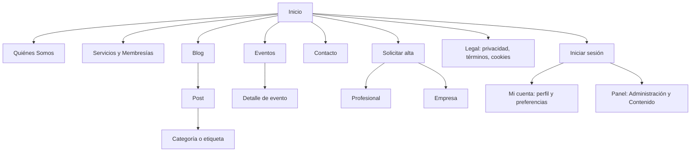
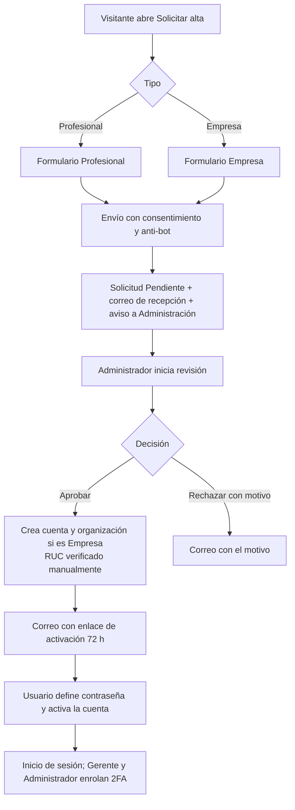
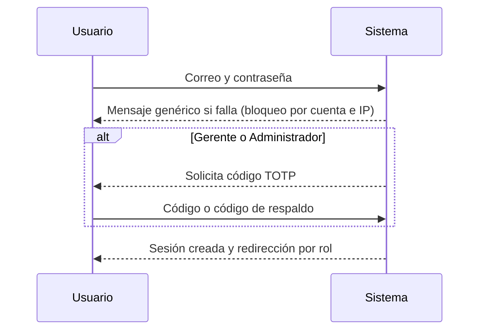
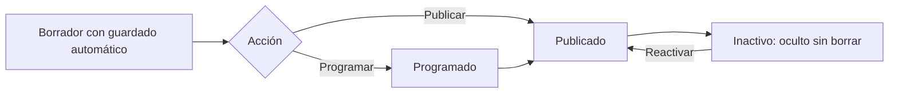

# NILOGISTIC — Fase 5 (C): UX, pantallas y contratos de API

| Campo | Valor |
|---|---|
| Versión | 0.1 (borrador para aprobación) |
| Fecha | 05/10/2026 |
| Fase | 5 de 9 — Diseño (documento C de 3) |
| Alcance | Arquitectura de información, inventario de 61 pantallas de R1, flujos clave, entregables del diseño visual y contratos de API de R1 |
| Nota | **El diseño visual lo aportas tú** y se entrega antes del 20/11/2026, separado de la Fase 5. Este documento define *qué* debe cubrir y *cuándo* se necesita cada pieza |
| Meta de aprobación | 30/10/2026 |

---

## 1. Principios de experiencia

| # | Principio | Consecuencia práctica |
|---|---|---|
| U1 | Sitio corporativo y comunitario, creíble y claro | Jerarquía simple; la propuesta de valor y la solicitud de alta están siempre a un clic |
| U2 | Móvil primero y rápido | Diseño para 360 px; presupuesto LCP ≤ 2,5 s (RNF-REN-01) |
| U3 | Accesible por defecto | WCAG 2.2 AA; contraste, foco y teclado desde los tokens (HU-037) |
| U4 | Mensajes genéricos en autenticación | No revelar si una cuenta existe (CV-01); el texto se define una vez |
| U5 | Nada se pierde al trabajar | Guardado automático de borradores y recuperación tras expirar la sesión (HU-071) |
| U6 | Estados explícitos | Cada pantalla tiene diseño de vacío, carga, error y éxito |
| U7 | Español neutro y profesional | Tuteo uniforme; términos logísticos consistentes (glosario por definir con negocio) |

---

## 2. Arquitectura de información



**Navegación principal pública:** Inicio · Quiénes Somos · Servicios · Eventos · Blog · Contacto · **Solicitar alta** (botón destacado) · Iniciar sesión. **Pie:** enlaces legales, preferencias de cookies y suscripción a la Newsletter.

**Panel (Gerente y Administrador):** menú lateral por área con acceso según permisos: Contenido (Posts, Categorías, Newsletters) para Gerente y Administrador; Administración (Usuarios, Permisos, Solicitudes, Eventos, Catálogos, Textos legales, Configuración, Auditoría, Tareas) solo para Administrador.

**Módulos de R2 y R3** (Empleo, Publicidad, Cursos, Tienda) se incorporan al menú de "Mi cuenta" y del panel con el mismo patrón; se diseñan antes de cada release.

---

## 3. Layouts y componentes

| Layout | Uso | Estructura |
|---|---|---|
| Público | Todas las páginas abiertas | Cabecera con navegación, contenido, pie con legales y suscripción; banner de cookies |
| Cuenta | Login, 2FA, activación, perfil | Cabecera simplificada, tarjeta central de ancho limitado |
| Panel | Administración y Contenido | Barra superior con usuario, menú lateral, área de contenido, migas de pan |

**Componentes que el diseño debe definir (con estados: normal, foco, activo, deshabilitado, error):**

| Grupo | Componentes |
|---|---|
| Acciones | Botón primario, secundario, de peligro y enlace; botón de carga |
| Formularios | Texto, área de texto, selector, casilla, opción, interruptor, carga de imagen con vista previa; mensaje de error por campo y resumen de errores; campo de código 2FA |
| Retroalimentación | Alertas de éxito, información, advertencia y error; aviso de borrador guardado; estados vacíos; esqueleto de carga |
| Navegación | Cabecera, menú móvil, menú lateral del panel, migas de pan, paginación, pestañas, enlace "saltar al contenido" |
| Contenido | Tarjeta de post, tarjeta de evento, bloque de pilares, bloque de suscripción, pie |
| Datos | Tabla con filtros y orden, etiqueta de estado (solicitud, post, newsletter, evento), matriz de permisos con interruptores, indicador de progreso de envío |
| Superposiciones | Modal de confirmación, banner y preferencias de cookies, reautenticación con 2FA |
| Especiales | Editor enriquecido (barra de herramientas), código QR de 2FA, lista de códigos de respaldo |

---

## 4. Inventario de pantallas de R1 (61)

La columna **Diseño necesario antes de** se calcula con el calendario base del backlog v1.3: el viernes anterior al inicio del primer sprint que implementa la pantalla (para el Sprint 1 coincide con tu fecha del 20/11). Si el calendario cambia (Sprint 0 en 16/11, recalibración tras el Sprint 1), estas fechas se desplazan igual.

| ID | Pantalla | Ruta | Rol | Layout | HU | Sprint | Diseño necesario antes de |
|---|---|---|---|---|---|---|---|
| P01 | Inicio | `/` | Visitante | Público | HU-040 | S6 | 29/01/2027 |
| P02 | Quiénes Somos | `/quienes-somos` | Visitante | Público | HU-041 | S1 | 20/11/2026 |
| P03 | Servicios y Membresías | `/servicios` | Visitante | Público | HU-042 | S3 | 18/12/2026 |
| P04 | Blog: listado y búsqueda | `/blog` | Visitante | Público | HU-051 | S7 | 12/02/2027 |
| P05 | Blog: categoría o etiqueta | `/blog/categoria/{slug}` | Visitante | Público | HU-051 | S7 | 12/02/2027 |
| P06 | Post: detalle | `/blog/{slug}` | Visitante | Público | HU-052 | S8 | 26/02/2027 |
| P07 | Eventos: listado | `/eventos` | Visitante | Público | HU-060 | S10 | 26/03/2027 |
| P08 | Evento: detalle | `/eventos/{slug}` | Visitante | Público | HU-060 | S10 | 26/03/2027 |
| P09 | Contacto | `/contacto` | Visitante | Público | HU-043 | S6 | 29/01/2027 |
| P10 | Contacto enviado | `/contacto/gracias` | Visitante | Público | HU-043 | S6 | 29/01/2027 |
| P11 | Solicitud de alta: elegir tipo | `/solicitar-alta` | Visitante | Público | HU-025, HU-026 | S4 | 01/01/2027 |
| P12 | Solicitud de alta: Profesional | `/solicitar-alta/profesional` | Visitante | Público | HU-025 | S4 | 01/01/2027 |
| P13 | Solicitud de alta: Empresa | `/solicitar-alta/empresa` | Visitante | Público | HU-026 | S4 | 01/01/2027 |
| P14 | Solicitud recibida | `/solicitar-alta/gracias` | Visitante | Público | HU-025, HU-026 | S4 | 01/01/2027 |
| P15 | Política de privacidad (y versiones) | `/legal/privacidad` | Visitante | Público | HU-044 | S3 | 18/12/2026 |
| P16 | Términos y condiciones (y versiones) | `/legal/terminos` | Visitante | Público | HU-044 | S3 | 18/12/2026 |
| P17 | Política de cookies (y versiones) | `/legal/cookies` | Visitante | Público | HU-044 | S3 | 18/12/2026 |
| P18 | Banner y preferencias de cookies | `(componente en todas las páginas)` | Visitante | Público | HU-045 | S3 | 18/12/2026 |
| P19 | Bloque de suscripción y mensaje de revisión del correo | `(componente) y /newsletter/suscripcion` | Visitante | Público | HU-053 | S8 | 26/02/2027 |
| P20 | Confirmación de suscripción | `/newsletter/confirmar/{token}` | Suscriptor | Público | HU-053 | S8 | 26/02/2027 |
| P21 | Baja de la Newsletter | `/newsletter/baja/{token}` | Suscriptor | Público | HU-054 | S8 | 26/02/2027 |
| P22 | Preferencias de la Newsletter | `/newsletter/preferencias/{token}` | Suscriptor | Público | HU-054 | S8 | 26/02/2027 |
| P23 | Error 404 y 403 | `(páginas de error)` | Todos | Público | HU-046 | S2 | 04/12/2026 |
| P24 | Error 429 y 500 | `(páginas de error)` | Todos | Público | HU-046 | S2 | 04/12/2026 |
| C01 | Iniciar sesión | `/cuenta/iniciar-sesion` | Todos | Cuenta | HU-014 | S4 | 01/01/2027 |
| C02 | Verificación 2FA | `/cuenta/2fa/verificar` | Gerente, Administrador | Cuenta | HU-022 | S5 | 15/01/2027 |
| C03 | Enrolamiento 2FA (QR y código) | `/cuenta/2fa/configurar` | Gerente, Administrador | Cuenta | HU-021 | S5 | 15/01/2027 |
| C04 | Códigos de respaldo (se muestran una vez) | `/cuenta/2fa/codigos` | Gerente, Administrador | Cuenta | HU-021 | S5 | 15/01/2027 |
| C05 | Usar código de respaldo | `/cuenta/2fa/respaldo` | Gerente, Administrador | Cuenta | HU-022 | S5 | 15/01/2027 |
| C06 | Activar cuenta y definir contraseña | `/cuenta/activar/{token}` | Usuario nuevo | Cuenta | HU-016 | S4 | 01/01/2027 |
| C07 | Enlace vencido o inválido y solicitud de uno nuevo | `/cuenta/activar/vencido` | Usuario nuevo | Cuenta | HU-016 | S4 | 01/01/2027 |
| C08 | Recuperar contraseña | `/cuenta/recuperar` | Todos | Cuenta | HU-017 | S4 | 01/01/2027 |
| C09 | Restablecer contraseña | `/cuenta/restablecer/{token}` | Todos | Cuenta | HU-017 | S4 | 01/01/2027 |
| C10 | Cambiar contraseña | `/cuenta/contrasena` | Autenticado | Cuenta | HU-017 | S4 | 01/01/2027 |
| C11 | Mi cuenta (inicio del cliente) | `/cuenta` | Cliente | Cuenta | HU-047 | S6 | 29/01/2027 |
| C12 | Mi perfil y preferencias de Newsletter | `/cuenta/perfil` | Autenticado | Cuenta | HU-047 | S6 | 29/01/2027 |
| C13 | Aviso de sesión expirada | `(aviso en el login)` | Autenticado | Cuenta | HU-015 | S4 | 01/01/2027 |
| A01 | Inicio del panel | `/admin` | Gerente, Administrador | Panel | HU-036 | S1 | 20/11/2026 |
| A02 | Usuarios: listado | `/admin/usuarios` | Administrador | Panel | HU-023 | S5 | 15/01/2027 |
| A03 | Usuario: crear y editar | `/admin/usuarios/{id}` | Administrador | Panel | HU-023 | S5 | 15/01/2027 |
| A04 | Permisos por rol y módulo | `/admin/permisos` | Administrador | Panel | HU-024 | S5 | 15/01/2027 |
| A05 | Solicitudes de alta: bandeja | `/admin/solicitudes` | Administrador | Panel | HU-027 | S6 | 29/01/2027 |
| A06 | Solicitud: detalle, aprobar y rechazar | `/admin/solicitudes/{id}` | Administrador | Panel | HU-028, HU-029 | S6 | 29/01/2027 |
| A07 | Textos legales: versiones | `/admin/legal` | Administrador | Panel | HU-032 | S3 | 18/12/2026 |
| A08 | Catálogos maestros | `/admin/catalogos` | Administrador | Panel | HU-061 | S8 | 26/02/2027 |
| A09 | Configuración general y de seguridad | `/admin/configuracion` | Administrador | Panel | HU-062 | S10 | 26/03/2027 |
| A10 | Remitentes y destinatarios de avisos | `/admin/configuracion/correo` | Administrador | Panel | HU-063 | S10 | 26/03/2027 |
| A11 | Reautenticación con 2FA (confirmar cambio) | `(modal o pantalla)` | Administrador | Panel | HU-062 | S10 | 26/03/2027 |
| A12 | Auditoría: consulta y detalle | `/admin/auditoria` | Administrador | Panel | HU-064 | S7 | 12/02/2027 |
| A13 | Estado de tareas programadas | `/admin/tareas` | Administrador | Panel | HU-035 | S1 | 20/11/2026 |
| A14 | Eventos: listado | `/admin/eventos` | Administrador | Panel | HU-059 | S10 | 26/03/2027 |
| A15 | Evento: crear y editar | `/admin/eventos/{id}` | Administrador | Panel | HU-059 | S10 | 26/03/2027 |
| G01 | Posts: listado | `/contenido/posts` | Gerente, Administrador | Panel | HU-048, HU-049 | S7 | 12/02/2027 |
| G02 | Post: editor, estados y programación | `/contenido/posts/{id}` | Gerente, Administrador | Panel | HU-048, HU-049 | S7 | 12/02/2027 |
| G03 | Post: vista previa | `/contenido/posts/{id}/vista-previa` | Gerente, Administrador | Panel | HU-048 | S7 | 12/02/2027 |
| G04 | Categorías y etiquetas | `/contenido/categorias` | Gerente, Administrador | Panel | HU-050 | S6 | 29/01/2027 |
| G05 | Newsletters: listado | `/contenido/newsletters` | Gerente, Administrador | Panel | HU-055 | S8 | 26/02/2027 |
| G06 | Newsletter: editor | `/contenido/newsletters/{id}` | Gerente, Administrador | Panel | HU-055 | S8 | 26/02/2027 |
| G07 | Newsletter: vista previa y envío de prueba | `/contenido/newsletters/{id}/prueba` | Gerente, Administrador | Panel | HU-056 | S8 | 26/02/2027 |
| G08 | Newsletter: confirmar envío a un segmento | `/contenido/newsletters/{id}/enviar` | Gerente, Administrador | Panel | HU-057 | S9 | 12/03/2027 |
| G09 | Newsletter: estado del envío | `/contenido/newsletters/{id}/estado` | Gerente, Administrador | Panel | HU-058 | S9 | 12/03/2027 |

Resumen: 24 pantallas públicas, 13 de cuenta y 24 de panel.

---

## 5. Flujos clave

### 5.1 Solicitud de alta, aprobación y activación



### 5.2 Inicio de sesión con 2FA



### 5.3 Publicación de un post



### 5.4 Suscripción a la Newsletter

```mermaid
sequenceDiagram
  participant V as Visitante
  participant S as Sistema
  V->>S: Correo + consentimiento + anti-bot
  S-->>V: Respuesta genérica; correo de confirmación
  V->>S: Abre el enlace (72 h)
  S-->>V: Suscripción confirmada; evidencia registrada
  V->>S: Baja en un clic desde cualquier correo
  S-->>V: Baja inmediata (mismo registro que el perfil)
```

---

## 6. Estados, mensajes y contenido

| Elemento | Regla |
|---|---|
| Estados de pantalla | Cada pantalla define vacío, carga, error y éxito |
| Mensajes de autenticación | Una sola redacción genérica para credenciales inválidas, cuenta inactiva, sin activar o bloqueada (CV-01) |
| Errores de formulario | Mensaje junto al campo y resumen al inicio; lenguaje claro y específico (HU-037 E3) |
| Confirmaciones | Mensaje visible y persistente tras acciones críticas (envío de solicitud, publicación, envío de newsletter) |
| Fechas y números | Fechas en formato local y zona de Nicaragua; precios con moneda (NIO o USD) |
| Contenido provisional | Cualquier texto o valor provisional se marca para impedir su publicación (RN-056) |
| Glosario | Términos logísticos y de membresía se fijan con negocio antes de redactar el contenido (tarea #5) |

---

## 7. Patrones de accesibilidad por componente

| Componente | Requisito |
|---|---|
| Formularios | Etiqueta visible asociada, ayuda y error vinculados con `aria-describedby`, errores anunciados con `aria-live` |
| Banner de cookies | No bloquea el contenido, operable por teclado, mismas prominencias para aceptar y rechazar |
| Menú móvil y modales | Gestión de foco, cierre con Escape, sin trampas de foco |
| Tablas del panel | Encabezados asociados, orden indicado de forma accesible, paginación navegable |
| Editor enriquecido | Barra operable por teclado, etiquetas en los botones, texto alternativo obligatorio en imágenes |
| Código 2FA y QR | Alternativa textual a la clave del QR; entrada con autocompletado de código de un solo uso |
| Estados por color | Nunca solo por color: texto o icono acompañan a cada estado |

---

## 8. Entregables del diseño visual (tu aportación)

### 8.1 Qué debe incluir

| Entregable | Contenido | Formato sugerido |
|---|---|---|
| Marca | Logotipo (horizontal y de icono; versión clara y oscura), favicon e imagen Open Graph de 1200×630 | SVG y PNG |
| Tokens | Paleta con contraste AA verificado, tipografías con licencia de uso web, escala tipográfica, espaciados, radios, sombras | Variables CSS o JSON de tokens |
| Retícula | Puntos de corte y columnas para 360, 768 y 1280 px | Especificación |
| Componentes | Los de la sección 3, con todos sus estados | Biblioteca en el archivo de diseño |
| Pantallas | Las del inventario (sección 4), en móvil, tablet y escritorio, con sus estados vacío, error y éxito | Archivo de diseño, nombrado con el ID de cada pantalla |
| Contenido | Textos definitivos o marcados como provisionales; imágenes con licencia y texto alternativo | Documento de contenido |
| Iconografía e imágenes | Set de iconos y fotografías o ilustraciones con licencia de uso | SVG y WebP |

### 8.2 Entrega mínima por niveles (alternativa si el tiempo no alcanza)

Tu compromiso es entregar todo antes del 20/11. Si el diseño completo se retrasa, el calendario permite entregar por niveles sin detener el desarrollo:

| Nivel | Qué | Fecha límite |
|---|---|---|
| N0 | Marca, tokens, retícula, componentes y los tres layouts | **20/11/2026** (antes del Sprint 1) |
| N1 | pantallas de los primeros sprints (hasta 18/12/2026): P02, A01, A13, P23, P24, P03, P15, P16, P17, P18, A07 | 20/11/2026 (la más próxima) |
| N2 | pantallas hasta el 05/02/2027: P11, P12, P13, P14, C01, C06, C07, C08, C09, C10, C13, C02, C03, C04, C05, A02, A03, A04, P01, P09, P10, C11, C12, A05, A06, G04 | 01/01/2027 (la más próxima) |
| N3 | resto de R1: P04, P05, A12, G01, G02, G03, P06, P19, P20, P21, P22, A08, G05, G06, G07, G08, G09, P07, P08, A09, A10, A11, A14, A15 | 12/02/2027 (la más próxima) |

### 8.3 Entrega a desarrollo

1. Los IDs del inventario (P01, C01, A01, G01, etc.) se usan en los nombres del archivo de diseño y en las HU.
2. Los tokens se entregan como archivo (CSS o JSON) para que HU-036 los use como única fuente.
3. Cada pantalla indica su diseño en las tres anchuras y los estados definidos en la sección 6.
4. Los cambios posteriores pasan por el backlog: si un cambio altera el alcance de una HU, se reestima.

---

## 9. Contratos de API (R1)

### 9.1 Convenciones

| Aspecto | Convención |
|---|---|
| Versionado y base | `/api/v1`; Swagger en Desarrollo y Staging (HU-002) |
| Formato | JSON en `camelCase`; fechas ISO 8601 en UTC con `Z`; dinero como número decimal más moneda |
| Autenticación | Cookie de sesión de la aplicación (mismo sitio) con token antifalsificación en la cabecera `X-CSRF-TOKEN`; la API no se ofrece a terceros en R1. Los webhooks se autentican por firma |
| Errores | `application/problem+json` (ProblemDetails) con `traceId`; errores de validación como lista por campo; sin trazas (CV-06) |
| Códigos | 200, 201, 204, 400 (validación), 401, 403, 404, 409 (duplicado o conflicto de concurrencia), 429 (con `Retry-After`) y 500 |
| Paginación | `?pagina=1&tamano=20` (máximo 100); respuesta `{ elementos, pagina, tamano, total }` |
| Orden y filtros | `?orden=-fecha` y filtros por campo documentados en cada recurso |
| Idempotencia | Cabecera `Idempotency-Key` en las acciones que envían correo (newsletter, contacto) |
| Sin DELETE | No existen verbos DELETE: inactivar es `POST …/inactivar` y reactivar es `POST …/reactivar` (RN-001) |
| DTO | `{Entidad}RequestDto` y `{Entidad}ResponseDto`; `PaginaResponseDto<T>` para listados |
| Límites | Política general de 120 por minuto por usuario autenticado, más las políticas específicas del documento A |

### 9.2 Catálogo de endpoints de R1

Las pantallas del panel y del sitio se sirven con acciones MVC que usan el mismo servicio de la BLL; estos endpoints son la interfaz REST equivalente y la que usa el JavaScript del navegador.

| Método y ruta | Rol y permiso | Propósito | HU |
|---|---|---|---|
| `POST /webhooks/resend` | Firma de Resend | Rebotes y quejas | HU-065 |
| `PUT /borradores/{clave}` | Autenticado (propios) | Guardar borrador automático | HU-071 |
| `GET /borradores/{clave}` | Autenticado (propios) | Recuperar borrador | HU-071 |
| `POST /borradores/{clave}/descartar` | Autenticado (propios) | Descartar borrador | HU-071 |
| `POST /archivos/imagenes` | Autenticado, CREATE según módulo | Subir imagen validada | HU-047, HU-048 |
| `GET /blog/posts` | Público | Listar posts publicados con filtros | HU-051 |
| `GET /blog/posts/{slug}` | Público | Detalle de post publicado | HU-052 |
| `GET /eventos` | Público | Listar eventos publicados | HU-060 |
| `GET /eventos/{slug}` | Público | Detalle de evento publicado | HU-060 |
| `POST /solicitudes-alta` | Público (anti-bot) | Enviar solicitud de alta | HU-025, HU-026 |
| `POST /contacto` | Público (anti-bot) | Enviar mensaje de contacto | HU-043 |
| `POST /newsletter/suscripciones` | Público (anti-bot) | Solicitar suscripción | HU-053 |
| `POST /newsletter/suscripciones/confirmar` | Token | Confirmar suscripción | HU-053 |
| `POST /newsletter/bajas` | Token | Baja en un clic | HU-054 |
| `PUT /newsletter/preferencias` | Token o autenticado | Actualizar temas | HU-054 |
| `GET /cuenta/perfil` | Autenticado | Ver perfil | HU-047 |
| `PUT /cuenta/perfil` | Autenticado | Actualizar perfil y preferencia | HU-047 |
| `GET /admin/usuarios` | Administrador, READ | Listar usuarios con filtros | HU-023 |
| `POST /admin/usuarios` | Administrador, CREATE | Crear usuario interno | HU-023 |
| `PUT /admin/usuarios/{id}` | Administrador, UPDATE | Editar usuario | HU-023 |
| `POST /admin/usuarios/{id}/inactivar` | Administrador, UPDATE | Inactivar usuario | HU-023 |
| `POST /admin/usuarios/{id}/reactivar` | Administrador, UPDATE | Reactivar usuario | HU-023 |
| `POST /admin/usuarios/{id}/desbloquear` | Administrador, UPDATE | Desbloquear cuenta | HU-018, HU-023 |
| `POST /admin/usuarios/{id}/reenviar-activacion` | Administrador, UPDATE | Reenviar activación | HU-023 |
| `POST /admin/usuarios/{id}/reiniciar-2fa` | Administrador, UPDATE | Reiniciar 2FA de otro usuario | HU-022 |
| `GET /admin/permisos` | Administrador, READ | Ver matriz de permisos | HU-024 |
| `PUT /admin/permisos` | Administrador, UPDATE | Modificar un permiso | HU-024 |
| `GET /admin/solicitudes` | Administrador, READ | Bandeja de solicitudes | HU-027 |
| `GET /admin/solicitudes/{id}` | Administrador, READ | Detalle de solicitud | HU-027 |
| `POST /admin/solicitudes/{id}/iniciar-revision` | Administrador, UPDATE | Tomar para revisión | HU-027 |
| `POST /admin/solicitudes/{id}/aprobar` | Administrador, UPDATE | Aprobar y crear cuenta | HU-028 |
| `POST /admin/solicitudes/{id}/rechazar` | Administrador, UPDATE | Rechazar con motivo | HU-029 |
| `GET /admin/legal · POST /admin/legal` | Administrador, READ y CREATE | Versiones de textos legales | HU-032 |
| `GET /admin/catalogos/{clave}` | Administrador, READ | Listar valores | HU-061 |
| `POST /admin/catalogos/{clave}/valores` | Administrador, CREATE | Crear valor | HU-061 |
| `PUT /admin/catalogos/{clave}/valores/{id}` | Administrador, UPDATE | Editar, inactivar o reactivar | HU-061 |
| `GET /admin/parametros` | Administrador, READ | Listar parámetros | HU-062 |
| `PUT /admin/parametros/{clave}` | Administrador, UPDATE (+2FA) | Cambiar parámetro | HU-062 |
| `GET /admin/destinatarios · PUT /admin/destinatarios` | Administrador, READ y UPDATE | Remitentes y listas de avisos | HU-063 |
| `GET /admin/auditoria · GET /admin/auditoria/{id}` | Administrador, READ | Consulta y detalle de auditoría | HU-064 |
| `GET /admin/tareas` | Administrador, READ | Estado de tareas | HU-035 |
| `GET /admin/eventos · POST /admin/eventos` | Administrador, READ y CREATE | Gestión de eventos | HU-059 |
| `PUT /admin/eventos/{id} · POST /admin/eventos/{id}/publicar|inactivar` | Administrador, UPDATE | Editar y cambiar estado | HU-059 |
| `GET /contenido/posts · POST /contenido/posts` | Gerente o Administrador, READ y CREATE | Posts | HU-048 |
| `PUT /contenido/posts/{id} · POST …/publicar|programar|inactivar|reactivar` | Gerente o Administrador, UPDATE | Editar y cambiar estado | HU-048, HU-049 |
| `GET|POST|PUT /contenido/categorias · /contenido/etiquetas` | Gerente o Administrador | Categorías y etiquetas | HU-050 |
| `GET|POST|PUT /contenido/newsletters` | Gerente o Administrador | Newsletters | HU-055 |
| `POST /contenido/newsletters/{id}/prueba` | Gerente o Administrador, UPDATE | Enviar prueba | HU-056 |
| `POST /contenido/newsletters/{id}/enviar` | Gerente o Administrador, UPDATE (+Idempotency-Key) | Enviar a un segmento | HU-057 |
| `GET /contenido/newsletters/{id}/estado` | Gerente o Administrador, READ | Estado del envío | HU-058 |

Total: 50 endpoints de R1. Los flujos de inicio de sesión, 2FA, activación y recuperación se sirven con acciones MVC de `Cuenta` (cookie y antifalsificación), no por la API, para mantener la sesión del lado del servidor.

---

## 10. Decisiones y puntos abiertos

| # | Punto | Propuesta |
|---|---|---|
| UX-1 | Modo oscuro | Fuera de R1; los tokens se diseñan para poder añadirlo |
| UX-2 | Idioma | Solo español (D-008); la estructura permite añadir otro después |
| UX-3 | Glosario y tono de comunicación | Definirlo con negocio antes de redactar el contenido (tarea #5) |
| UX-4 | Herramienta de diseño y formato de tokens | La que ya uses; lo importante es el archivo de tokens y los IDs de pantallas |
| API-1 | Exponer la API a terceros | No en R1 (sin claves de API); se evalúa con una necesidad real |
